<p align="center">
  
</p>

<h1 align="center">
  
</h1>

<p align="center">
  
  
  
</p>

<p align="center">
  <em>I build turnkey desktop tools, browser enhancements, and system automation utilities.<br/>Everything ships dark-themed, zero-config, and ready to run.</em>
</p>

---

### 🧰 Tech Stack

<p align="center">
  
  
  
  
  
  
</p>

<p align="center">
  
  
  
  
  
  
</p>

---

### 📊 GitHub Stats

<p align="center">
  <picture>
    <source media="(prefers-color-scheme: dark)" srcset="https://github-readme-stats.vercel.app/api?username=SysAdminDoc&show_icons=true&theme=github_dark&hide_border=true&bg_color=00000000&title_color=58a6ff&icon_color=1f6feb&text_color=c9d1d9&ring_color=1f6feb" />
    
  </picture>
  <picture>
    <source media="(prefers-color-scheme: dark)" srcset="https://github-readme-stats.vercel.app/api/top-langs/?username=SysAdminDoc&layout=compact&theme=github_dark&hide_border=true&bg_color=00000000&title_color=58a6ff&text_color=c9d1d9&langs_count=8" />
    
  </picture>
</p>

<p align="center">
  <picture>
    <source media="(prefers-color-scheme: dark)" srcset="https://github-readme-streak-stats.herokuapp.com?user=SysAdminDoc&theme=github-dark-blue&hide_border=true&background=00000000&ring=1f6feb&fire=f78166&currStreakLabel=c9d1d9&sideLabels=c9d1d9&dates=8b949e" />
    
  </picture>
</p>

<p align="center">
  <picture>
    <source media="(prefers-color-scheme: dark)" srcset="https://github-profile-trophy.vercel.app/?username=SysAdminDoc&theme=darkhub&no-frame=true&no-bg=true&column=7&margin-w=10" />
    
  </picture>
</p>

---

## 🚀 Projects

### ⭐ Featured

<table>
  <tr>
    <td width="50%" valign="top">
      <h3><a href="https://github.com/SysAdminDoc/win11-nvme-driver-patcher">⚡ win11-nvme-driver-patcher</a></h3>
      <p><code>PowerShell</code> · ⭐ 10</p>
      <p>GUI tool to enable the experimental Windows Server 2025 NVMe storage driver on Windows 11. Most starred repo — solves a real sysadmin pain point.</p>
    </td>
    <td width="50%" valign="top">
      <h3><a href="https://github.com/SysAdminDoc/LibreWolf_DarkPortable">🌙 LibreWolf DarkPortable</a></h3>
      <p><code>JavaScript</code> · ⭐ 7</p>
      <p>Complete dark theme configuration for LibreWolf. For dark theme lovers — portable, preconfigured, and ready to run.</p>
    </td>
  </tr>
  <tr>
    <td width="50%" valign="top">
      <h3><a href="https://github.com/SysAdminDoc/LibreSpot">🎵 LibreSpot</a></h3>
      <p><code>PowerShell</code> · ⭐ 5</p>
      <p>Streamlined Spotify customization tool. Automates Spicetify installation, themes, and extensions in one click.</p>
    </td>
    <td width="50%" valign="top">
      <h3><a href="https://github.com/SysAdminDoc/Network_Security_Auditor">🛡️ Network Security Auditor</a></h3>
      <p><code>PowerShell</code> · ⭐ 2</p>
      <p>Runs 67 automated security checks across 8 domains with MITRE ATT&CK mapping. Enterprise-grade audit tool.</p>
    </td>
  </tr>
</table>

---

<details>
<summary><h3>⚡ PowerShell System Utilities <sub>(12 repos)</sub></h3></summary>

| Project | Description |
|:--------|:------------|
| [**win11-nvme-driver-patcher**](https://github.com/SysAdminDoc/win11-nvme-driver-patcher) ⭐10 | GUI to enable Windows Server 2025 NVMe driver on Win11 |
| [**LibreSpot**](https://github.com/SysAdminDoc/LibreSpot) ⭐5 | Spotify customization — automates Spicetify, themes, extensions |
| [**Network_Security_Auditor**](https://github.com/SysAdminDoc/Network_Security_Auditor) ⭐2 | 67 automated checks across 8 security domains, MITRE ATT&CK mapping |
| [**Wingetter**](https://github.com/SysAdminDoc/Wingetter) | Discover, select, and bulk install software via Winget |
| [**Start-Menu-Organizer**](https://github.com/SysAdminDoc/Start-Menu-Organizer) | Clean junk, detect broken shortcuts, reorganize Start Menu |
| [**PathForge**](https://github.com/SysAdminDoc/PathForge) | Filesystem repair, stubborn file deletion, path management |
| [**MonitorControl**](https://github.com/SysAdminDoc/MonitorControl) | Control monitor settings via DDC/CI |
| [**PfblockerngManager**](https://github.com/SysAdminDoc/PfblockerngManager) | GUI for managing pfBlockerNG on pfSense firewalls |
| [**npp-sc-scanner**](https://github.com/SysAdminDoc/npp-sc-scanner) | Detect and remediate Notepad++ supply chain attack IOCs |
| [**JDownloader-2-Ultimate-Manager**](https://github.com/SysAdminDoc/JDownloader-2-Ultimate-Manager) | Comprehensive automation for JDownloader 2 |
| [**YTYT-Downloader**](https://github.com/SysAdminDoc/YTYT-Downloader) | Stream YouTube to VLC or download with yt-dlp |
| [**ThankYouJeffrey**](https://github.com/SysAdminDoc/ThankYouJeffrey) | A tribute to the creator of PowerShell, Jeffrey Snover |

</details>

<details>
<summary><h3>🐍 Python Desktop Applications <sub>(20 repos)</sub></h3></summary>

| Project | Description |
|:--------|:------------|
| [**PyWall**](https://github.com/SysAdminDoc/PyWall) | Real-time Windows Firewall manager and network monitor |
| [**PyShop**](https://github.com/SysAdminDoc/PyShop) | Open source Photoshop alternative |
| [**SwiftShot**](https://github.com/SysAdminDoc/SwiftShot) | Debloated, Greenshot-inspired screenshot tool |
| [**Flux**](https://github.com/SysAdminDoc/Flux) | Privacy-focused BitTorrent client — PyQt6 + libtorrent |
| [**GitForge**](https://github.com/SysAdminDoc/GitForge) | Full GitHub repo manager — clone, sync, diff, manage |
| [**UniversalCompiler**](https://github.com/SysAdminDoc/UniversalCompiler) | All-in-one script-to-EXE compiler |
| [**OpenCut**](https://github.com/SysAdminDoc/OpenCut) | Video editing automation for Premiere Pro |
| [**bypassnroGen**](https://github.com/SysAdminDoc/bypassnroGen) | Generate Windows 11 OOBE bypass files |
| [**MSStoreHelper**](https://github.com/SysAdminDoc/MSStoreHelper) | Install Microsoft Store apps without the Store |
| [**Qwen3-TTS-Studio**](https://github.com/SysAdminDoc/Qwen3-TTS-Studio) | AI voice generator powered by Qwen3-TTS |
| [**AppList**](https://github.com/SysAdminDoc/AppList) | Scan, catalog, and export all installed applications |
| [**PillSleepTracker**](https://github.com/SysAdminDoc/PillSleepTracker) | Floating widget for medication tracking + sleep analytics |
| [**Mattpad**](https://github.com/SysAdminDoc/Mattpad) | Minimal notepad built for personal workflow |
| [**HostsFileGet**](https://github.com/SysAdminDoc/HostsFileGet) | GUI for managing the Windows hosts file |
| [**Bookmark-Organizer-Pro**](https://github.com/SysAdminDoc/Bookmark-Organizer-Pro) | AI-powered bookmark manager and categorizer |
| [**QR-Code-Generator-Pro**](https://github.com/SysAdminDoc/QR-Code-Generator-Pro) | QR generator with 98 visual style presets |
| [**uBlock-Stylus-Converter**](https://github.com/SysAdminDoc/uBlock-Stylus-Converter) | Convert uBlock cosmetic filters to Stylus CSS |
| [**KeepSyncNotes**](https://github.com/SysAdminDoc/KeepSyncNotes) | Google Keep importer and note tracker |
| [**PDFedit**](https://github.com/SysAdminDoc/PDFedit) | Simple PDF editor |
| [**CSV_Power_Tool**](https://github.com/SysAdminDoc/CSV_Power_Tool) | Bulk CSV processing and consolidation |

</details>

<details>
<summary><h3>🌐 Web Applications <sub>(7 repos)</sub></h3></summary>

| Project | Description |
|:--------|:------------|
| [**StormviewRadar**](https://github.com/SysAdminDoc/StormviewRadar) | Open source weather radar viewer |
| [**SkyTrack**](https://github.com/SysAdminDoc/SkyTrack) ⭐1 | Real-time aircraft tracker — commercial, military, helicopters |
| [**SPECTRE**](https://github.com/SysAdminDoc/SPECTRE) | Intelligence aggregator platform |
| [**CoolSites**](https://github.com/SysAdminDoc/CoolSites) | Curated directory of 470+ free tools and open source projects |
| [**Multistreamer**](https://github.com/SysAdminDoc/Multistreamer) | Self-hosted multi-video streaming viewer with chat |
| [**ImageForge**](https://github.com/SysAdminDoc/ImageForge) | Open source image converter |
| [**BookmarkVault**](https://github.com/SysAdminDoc/BookmarkVault) | Bookmark management web app |

</details>

<details>
<summary><h3>🧩 Browser Extensions & Userscripts <sub>(20 repos)</sub></h3></summary>

| Project | Description |
|:--------|:------------|
| [**LibreWolf_DarkPortable**](https://github.com/SysAdminDoc/LibreWolf_DarkPortable) ⭐7 | Complete dark theme config for LibreWolf |
| [**YTKit**](https://github.com/SysAdminDoc/YTKit) ⭐2 | Ultimate YouTube customization userscript |
| [**EspressoMonkey**](https://github.com/SysAdminDoc/EspressoMonkey) | Modern userscript manager — Manifest V3 |
| [**Reddit-Enhancement-Continued**](https://github.com/SysAdminDoc/Reddit-Enhancement-Continued) | Enhancement suite for old.reddit.com |
| [**Doordash-Enhanced**](https://github.com/SysAdminDoc/Doordash-Enhanced) | DoorDash dark mode and feature enhancements |
| [**NoNinite**](https://github.com/SysAdminDoc/NoNinite) | Converts ninite.com into Winget/Chocolatey script generator |
| [**DarkModer**](https://github.com/SysAdminDoc/DarkModer) | Dark Reader as a userscript |
| [**GPTDock**](https://github.com/SysAdminDoc/GPTDock) | Productivity features for ChatGPT |
| [**GeminiBuddy**](https://github.com/SysAdminDoc/GeminiBuddy) | Productivity features for Gemini |
| [**RumbleX**](https://github.com/SysAdminDoc/RumbleX) | Comprehensive Rumble.com enhancement |
| [**DiggSuite**](https://github.com/SysAdminDoc/DiggSuite) | Multi-theme + redesigned UI for Digg |
| [**OldRedditHelper**](https://github.com/SysAdminDoc/OldRedditHelper) | Enhancements for old Reddit |
| [**Gmailified**](https://github.com/SysAdminDoc/Gmailified) | Enhancement extension for Gmail |
| [**BetterNext**](https://github.com/SysAdminDoc/BetterNext) | Enhanced NextDNS Control Panel |
| [**gSearchTweaks**](https://github.com/SysAdminDoc/gSearchTweaks) | Adds YouTube/Reddit/GitHub to Google toolbar |
| [**ScrollJumper**](https://github.com/SysAdminDoc/ScrollJumper) | Right-click scrollbar to jump anywhere |
| [**HNCC**](https://github.com/SysAdminDoc/HNCC) | Collapsible child comments on Hacker News |
| [**fDeBloat**](https://github.com/SysAdminDoc/fDeBloat) | Facebook debloater (beta) |
| [**UserscriptDevBuddy**](https://github.com/SysAdminDoc/UserscriptDevBuddy) | AI-powered in-page dev tools for userscript authors |
| [**AutoPagerUniversal**](https://github.com/SysAdminDoc/AutoPagerUniversal) | Universal auto-pagination |

</details>

<details>
<summary><h3>🔒 Security & Networking <sub>(4 repos)</sub></h3></summary>

| Project | Description |
|:--------|:------------|
| [**HOSTShield**](https://github.com/SysAdminDoc/HOSTShield) | Aggressive, categorized hosts files for ad/tracker/malware blocking |
| [**pfSenseSuite**](https://github.com/SysAdminDoc/pfSenseSuite) | pfSense scripts and customizations toolkit |
| [**NextDNSPanel**](https://github.com/SysAdminDoc/NextDNSPanel) | Tools and enhancements for NextDNS |
| [**ESET**](https://github.com/SysAdminDoc/ESET) | Complete ESET port and address reference lists |

</details>

<details>
<summary><h3>🎬 Media & Conversion Tools <sub>(7 repos)</sub></h3></summary>

| Project | Description |
|:--------|:------------|
| [**VideoCrush**](https://github.com/SysAdminDoc/VideoCrush) | Video compression and processing |
| [**yt_livestream_downloader**](https://github.com/SysAdminDoc/yt_livestream_downloader) | Download livestreams while they're still live |
| [**MediaForge**](https://github.com/SysAdminDoc/MediaForge) | Multi-format media converter |
| [**MediaDL**](https://github.com/SysAdminDoc/MediaDL) | Media downloader |
| [**UniversalConverterX**](https://github.com/SysAdminDoc/UniversalConverterX) | Native Windows file converter with context menu integration |
| [**VideoSubtitleRemover**](https://github.com/SysAdminDoc/VideoSubtitleRemover) | Remove hardcoded subtitles from video |
| [**Text-Filter-Editor**](https://github.com/SysAdminDoc/Text-Filter-Editor) | Text filter editor |

</details>

<details>
<summary><h3>📚 Guides & Resources <sub>(2 repos)</sub></h3></summary>

| Project | Description |
|:--------|:------------|
| [**AI_Realism**](https://github.com/SysAdminDoc/AI_Realism) | Field guide for ultra-realistic AI video generation |
| [**sysadmindoc.github.io**](https://github.com/SysAdminDoc/sysadmindoc.github.io) | ATLAST — A VEO-made sci-fi thriller |

</details>

---

### 🏗️ What I Build

```
┌──────────────────────────────────────────────────────────────────┐
│                                                                  │
│   💻  Windows system tools        →  PowerShell WPF GUIs        │
│   🐍  Desktop applications        →  Python PyQt6 apps          │
│   🧩  Browser customization       →  Userscripts & extensions   │
│   🌐  Web apps                    →  OSINT, radar, trackers     │
│   🔒  Security hardening          →  Auditing & network tools   │
│   🎬  Media processing            →  Converters & downloaders   │
│                                                                  │
│   Design philosophy:  Dark themes · Zero config · Turnkey       │
│                                                                  │
└──────────────────────────────────────────────────────────────────┘
```

---

<p align="center">
  
</p>
