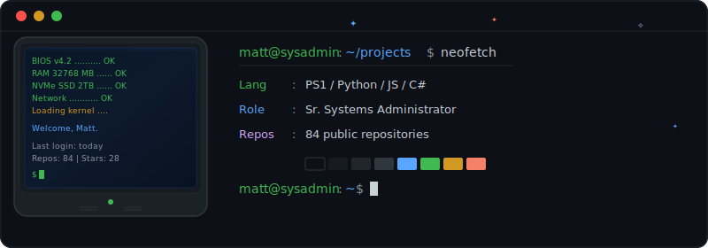

<p align="center">
  
</p>

<p align="center">
  
</p>

<p align="center">
  
</p>

---

Systems Administrator who spends nights and weekends building the tools I wish existed. Most of what you'll find here started as a personal itch, a script that grew legs, a browser annoyance I finally fixed, or a desktop app I couldn't find anywhere else.

Everything I ship is intentionally **zero-config and ready to run.** No setup wizards, no dependency hunts. Download it, launch it, done.

📦 **[View my full portfolio →](https://sysadmindoc.github.io/)**

---

<p align="center">
  
  
  
  
  
  
</p>

<p align="center">
  
  
  
  
  
  
</p>

---

<details>
<summary><b>⚡ PowerShell System Utilities</b> — 13 repos</summary>
<br/>

[**win11-nvme-driver-patcher**](https://github.com/SysAdminDoc/win11-nvme-driver-patcher) ⭐15 — GUI to enable Windows Server 2025 NVMe driver on Win11
```powershell
irm "https://raw.githubusercontent.com/SysAdminDoc/win11-nvme-driver-patcher/main/NVMe_Driver_Patcher_v3.0.0.ps1" | iex
```

[**LibreSpot**](https://github.com/SysAdminDoc/LibreSpot) ⭐5 — Spotify customization — automates Spicetify, themes, extensions
```powershell
irm "https://raw.githubusercontent.com/SysAdminDoc/LibreSpot/main/LibreSpot.ps1" | iex
```

[**Network_Security_Auditor**](https://github.com/SysAdminDoc/Network_Security_Auditor) ⭐6 — 67 automated checks across 8 security domains, MITRE ATT&CK mapping
```powershell
irm "https://raw.githubusercontent.com/SysAdminDoc/Network_Security_Auditor/main/NetworkSecurityAudit.ps1" | iex
```

[**Wingetter**](https://github.com/SysAdminDoc/Wingetter) ⭐1 — Discover, select, and bulk install software via Winget
```powershell
irm "https://raw.githubusercontent.com/SysAdminDoc/Wingetter/main/Wingetter.ps1" | iex
```

[**Start-Menu-Organizer**](https://github.com/SysAdminDoc/Start-Menu-Organizer) — Clean junk, detect broken shortcuts, reorganize Start Menu
```powershell
irm "https://raw.githubusercontent.com/SysAdminDoc/Start-Menu-Organizer/main/StartMenuOrganizerPro.ps1" | iex
```

[**PathForge**](https://github.com/SysAdminDoc/PathForge) — Filesystem repair, stubborn file deletion, path management
```powershell
irm "https://raw.githubusercontent.com/SysAdminDoc/PathForge/main/PathForge.ps1" | iex
```

[**MonitorControl**](https://github.com/SysAdminDoc/MonitorControl) — Control monitor settings via DDC/CI
```powershell
irm "https://raw.githubusercontent.com/SysAdminDoc/MonitorControl/main/MonitorControlPro.ps1" | iex
```

[**PfblockerngManager**](https://github.com/SysAdminDoc/PfblockerngManager) — GUI for managing pfBlockerNG on pfSense firewalls
```powershell
irm "https://raw.githubusercontent.com/SysAdminDoc/PfblockerngManager/main/pfBlockerNG-Manager.ps1" | iex
```

[**npp-sc-scanner**](https://github.com/SysAdminDoc/npp-sc-scanner) — Detect and remediate Notepad++ supply chain attack IOCs
```powershell
irm "https://raw.githubusercontent.com/SysAdminDoc/npp-sc-scanner/main/NppScanner-GUI.ps1" | iex
```

[**JDownloader-2-Ultimate-Manager**](https://github.com/SysAdminDoc/JDownloader-2-Ultimate-Manager) — Comprehensive automation for JDownloader 2
```powershell
irm "https://raw.githubusercontent.com/SysAdminDoc/JDownloader-2-Ultimate-Manager/main/JDownloader%202%20Ultimate%20Manager.ps1" | iex
```

[**YTYT-Downloader**](https://github.com/SysAdminDoc/YTYT-Downloader) — Stream YouTube to VLC or download with yt-dlp
```powershell
irm "https://raw.githubusercontent.com/SysAdminDoc/YTYT-Downloader/main/src/Install-YTYT.ps1" | iex
```

[**ThankYouJeffrey**](https://github.com/SysAdminDoc/ThankYouJeffrey) — A tribute to the creator of PowerShell, Jeffrey Snover
```powershell
irm "https://raw.githubusercontent.com/SysAdminDoc/ThankYouJeffrey/main/ThankYouJeffrey.ps1" | iex
```

[**EXTRACTORX**](https://github.com/SysAdminDoc/EXTRACTORX) — Open-source bulk archive extraction tool for Windows
```powershell
irm "https://raw.githubusercontent.com/SysAdminDoc/EXTRACTORX/main/EXTRACTORX.ps1" | iex
```

</details>

<details>
<summary><b>🐍 Python Desktop Applications</b> — 24 repos — <i>Requires Python 3.8+. All deps auto-install on first run.</i></summary>
<br/>

[**PyWall**](https://github.com/SysAdminDoc/PyWall) — Real-time Windows Firewall manager and network monitor
```powershell
irm "https://raw.githubusercontent.com/SysAdminDoc/PyWall/main/PyWall.py" -OutFile "$env:TEMP\PyWall.py"; python "$env:TEMP\PyWall.py"
```

[**HostsGuard**](https://github.com/SysAdminDoc/HostsGuard) — Real-time network privacy manager — DNS monitoring, hosts file management, firewall rules
```powershell
irm "https://raw.githubusercontent.com/SysAdminDoc/HostsGuard/main/HostsGuard.py" -OutFile "$env:TEMP\HostsGuard.py"; python "$env:TEMP\HostsGuard.py"
```

[**PyShop**](https://github.com/SysAdminDoc/PyShop) — Open source Photoshop alternative
```powershell
irm "https://raw.githubusercontent.com/SysAdminDoc/PyShop/main/pyshop_image_editor.py" -OutFile "$env:TEMP\pyshop.py"; python "$env:TEMP\pyshop.py"
```

[**SwiftShot**](https://github.com/SysAdminDoc/SwiftShot) — Debloated, Greenshot-inspired screenshot tool
```powershell
irm "https://raw.githubusercontent.com/SysAdminDoc/SwiftShot/main/SwiftShot/Install-SwiftShot.ps1" | iex
```

[**Flux**](https://github.com/SysAdminDoc/Flux) — Privacy-focused BitTorrent client — PyQt6 + libtorrent
```powershell
irm "https://raw.githubusercontent.com/SysAdminDoc/Flux/main/flux-torrent/Launch-Flux.ps1" | iex
```

[**GitForge**](https://github.com/SysAdminDoc/GitForge) — Full GitHub repo manager — clone, sync, diff, manage
```powershell
irm "https://raw.githubusercontent.com/SysAdminDoc/GitForge/main/gitforge.py" -OutFile "$env:TEMP\gitforge.py"; python "$env:TEMP\gitforge.py"
```

[**UniversalCompiler**](https://github.com/SysAdminDoc/UniversalCompiler) — All-in-one script-to-EXE compiler
```powershell
irm "https://raw.githubusercontent.com/SysAdminDoc/UniversalCompiler/main/UniversalCompiler.ps1" | iex
```

[**OpenCut**](https://github.com/SysAdminDoc/OpenCut) — Video editing automation for Premiere Pro
```powershell
irm "https://raw.githubusercontent.com/SysAdminDoc/OpenCut/main/Install.ps1" | iex
```

[**bypassnroGen**](https://github.com/SysAdminDoc/bypassnroGen) — Generate Windows 11 OOBE bypass files
```powershell
irm "https://raw.githubusercontent.com/SysAdminDoc/bypassnroGen/main/BypassNRO_Generator.py" -OutFile "$env:TEMP\bypassnro.py"; python "$env:TEMP\bypassnro.py"
```

[**MSStoreHelper**](https://github.com/SysAdminDoc/MSStoreHelper) — Install Microsoft Store apps without the Store
```powershell
irm "https://raw.githubusercontent.com/SysAdminDoc/MSStoreHelper/main/MSStoreHelper.py" -OutFile "$env:TEMP\MSStoreHelper.py"; python "$env:TEMP\MSStoreHelper.py"
```

[**Qwen3-TTS-Studio**](https://github.com/SysAdminDoc/Qwen3-TTS-Studio) — AI voice generator powered by Qwen3-TTS
```powershell
irm "https://raw.githubusercontent.com/SysAdminDoc/Qwen3-TTS-Studio/main/qwen3_tts_studio.py" -OutFile "$env:TEMP\qwen3tts.py"; python "$env:TEMP\qwen3tts.py"
```

[**AppList**](https://github.com/SysAdminDoc/AppList) — Scan, catalog, and export all installed applications
```powershell
irm "https://raw.githubusercontent.com/SysAdminDoc/AppList/main/AppList.py" -OutFile "$env:TEMP\AppList.py"; python "$env:TEMP\AppList.py"
```

[**PillSleepTracker**](https://github.com/SysAdminDoc/PillSleepTracker) — Floating widget for medication tracking + sleep analytics
```powershell
irm "https://raw.githubusercontent.com/SysAdminDoc/PillSleepTracker/main/Launch-PillSleepTracker.ps1" | iex
```

[**Mattpad**](https://github.com/SysAdminDoc/Mattpad) — Minimal notepad built for personal workflow
```powershell
irm "https://raw.githubusercontent.com/SysAdminDoc/Mattpad/main/mattpad.py" -OutFile "$env:TEMP\mattpad.py"; python "$env:TEMP\mattpad.py"
```

[**HostsFileGet**](https://github.com/SysAdminDoc/HostsFileGet) — GUI for managing the Windows hosts file
```powershell
irm "https://raw.githubusercontent.com/SysAdminDoc/HostsFileGet/main/PythonLauncher.ps1" | iex
```

[**Bookmark-Organizer-Pro**](https://github.com/SysAdminDoc/Bookmark-Organizer-Pro) — AI-powered bookmark manager and categorizer
```powershell
irm "https://raw.githubusercontent.com/SysAdminDoc/Bookmark-Organizer-Pro/main/bookmark_organizer_pro_v4.py" -OutFile "$env:TEMP\bookmarks.py"; python "$env:TEMP\bookmarks.py"
```

[**QR-Code-Generator-Pro**](https://github.com/SysAdminDoc/QR-Code-Generator-Pro) — QR generator with 98 visual style presets
```powershell
irm "https://raw.githubusercontent.com/SysAdminDoc/QR-Code-Generator-Pro/main/qr_code_generator_pro_v7.py" -OutFile "$env:TEMP\qrgen.py"; python "$env:TEMP\qrgen.py"
```

[**uBlock-Stylus-Converter**](https://github.com/SysAdminDoc/uBlock-Stylus-Converter) — Convert uBlock cosmetic filters to Stylus CSS
```powershell
irm "https://raw.githubusercontent.com/SysAdminDoc/uBlock-Stylus-Converter/main/ublocktoCSS.py" -OutFile "$env:TEMP\ublock2css.py"; python "$env:TEMP\ublock2css.py"
```

[**KeepSyncNotes**](https://github.com/SysAdminDoc/KeepSyncNotes) — Google Keep importer and note tracker
```powershell
irm "https://raw.githubusercontent.com/SysAdminDoc/KeepSyncNotes/main/keepsync_notes.py" -OutFile "$env:TEMP\keepsync.py"; python "$env:TEMP\keepsync.py"
```

[**PDFedit**](https://github.com/SysAdminDoc/PDFedit) — Simple PDF editor
```powershell
irm "https://raw.githubusercontent.com/SysAdminDoc/PDFedit/main/PDFedit.py" -OutFile "$env:TEMP\PDFedit.py"; python "$env:TEMP\PDFedit.py"
```

[**CSV_Power_Tool**](https://github.com/SysAdminDoc/CSV_Power_Tool) — Bulk CSV processing and consolidation
```powershell
irm "https://raw.githubusercontent.com/SysAdminDoc/CSV_Power_Tool/main/CSV_Consolidator.py" -OutFile "$env:TEMP\csvtool.py"; python "$env:TEMP\csvtool.py"
```

[**AI-Model-Compass**](https://github.com/SysAdminDoc/AI-Model-Compass) — Discover, download, and run local AI models tailored to your hardware
```powershell
irm "https://raw.githubusercontent.com/SysAdminDoc/AI-Model-Compass/main/AI-Model-Compass.py" -OutFile "$env:TEMP\aicompass.py"; python "$env:TEMP\aicompass.py"
```

[**DICOM-PACS-Migrator**](https://github.com/SysAdminDoc/DICOM-PACS-Migrator) — Bulk DICOM C-STORE migration with network auto-discovery and crash-safe resume
```powershell
irm "https://raw.githubusercontent.com/SysAdminDoc/DICOM-PACS-Migrator/main/DICOM-PACS-Migrator.py" -OutFile "$env:TEMP\dicom.py"; python "$env:TEMP\dicom.py"
```

[**Stock-Video-Collector**](https://github.com/SysAdminDoc/Stock-Video-Collector) — Stock video collector
```powershell
irm "https://raw.githubusercontent.com/SysAdminDoc/Stock-Video-Collector/main/Stock-Video-Collector.py" -OutFile "$env:TEMP\stockvid.py"; python "$env:TEMP\stockvid.py"
```

</details>

<details>
<summary><b>🌐 Web Applications</b> — 13 repos — <i>Click to open in browser, no install needed.</i></summary>
<br/>

| Project | Description | Live |
|:--------|:------------|:----:|
| [**Openshop**](https://github.com/SysAdminDoc/Openshop) | Free browser-based image editor — layers, AI tools, PSD import | [Launch](https://sysadmindoc.github.io/Openshop/) |
| [**StormviewRadar**](https://github.com/SysAdminDoc/StormviewRadar) | Open source weather radar viewer | [Launch](https://sysadmindoc.github.io/StormviewRadar/) |
| [**SkyTrack**](https://github.com/SysAdminDoc/SkyTrack) ⭐1 | Real-time aircraft tracker — commercial, military, helicopters | [Launch](https://sysadmindoc.github.io/SkyTrack/) |
| [**SPECTRE**](https://github.com/SysAdminDoc/SPECTRE) | Intelligence aggregator platform | [Launch](https://sysadmindoc.github.io/SPECTRE/) |
| [**CoolSites**](https://github.com/SysAdminDoc/CoolSites) | Curated directory of 470+ free tools and open source projects | [Launch](https://sysadmindoc.github.io/CoolSites/) |
| [**Multistreamer**](https://github.com/SysAdminDoc/Multistreamer) | Multi-video streaming viewer with chat | [Launch](https://sysadmindoc.github.io/Multistreamer/) |
| [**ImageForge**](https://github.com/SysAdminDoc/ImageForge) | Open source image converter | [Launch](https://sysadmindoc.github.io/ImageForge/) |
| [**BookmarkVault**](https://github.com/SysAdminDoc/BookmarkVault) | Bookmark management web app | [Launch](https://sysadmindoc.github.io/BookmarkVault/) |
| [**Text-Filter-Editor**](https://github.com/SysAdminDoc/Text-Filter-Editor) | Text filtering and processing tool | [Launch](https://sysadmindoc.github.io/Text-Filter-Editor/) |
| [**DeGoogler**](https://github.com/SysAdminDoc/DeGoogler) | Turnkey migration toolkit for leaving Google services | [Launch](https://sysadmindoc.github.io/DeGoogler/) |
| [**SearchHub**](https://github.com/SysAdminDoc/SearchHub) | Search 538 engines across 29 categories | [Launch](https://sysadmindoc.github.io/SearchHub/) |
| [**UserScriptHunt**](https://github.com/SysAdminDoc/UserScriptHunt) | Unified search engine for userscripts | [Launch](https://sysadmindoc.github.io/UserScriptHunt/) |
| [**RadAtlas**](https://github.com/SysAdminDoc/RadAtlas) | Prototyping | — |

</details>

<details>
<summary><b>🧩 Browser Extensions & Userscripts</b> — 15 repos — <i>Requires <a href="https://www.tampermonkey.net/">Tampermonkey</a> or <a href="https://violentmonkey.github.io/">Violentmonkey</a>.</i></summary>
<br/>

| Project | Description | Install |
|:--------|:------------|:-------:|
| [**YouTube-Kit**](https://github.com/SysAdminDoc/YouTube-Kit) ⭐2 | Ultimate YouTube customization userscript | [Install](https://raw.githubusercontent.com/SysAdminDoc/YouTube-Kit/main/YTKit.user.js) |
| [**YoutubeAdblock**](https://github.com/SysAdminDoc/YoutubeAdblock) | Undetectable YouTube ad blocker with proxy engine | [Install](https://raw.githubusercontent.com/SysAdminDoc/YoutubeAdblock/main/YoutubeAdblock.user.js) |
| [**Chapterizer**](https://github.com/SysAdminDoc/Chapterizer) | Auto-generate YouTube chapters, detect filler words, skip pauses | [Install](https://raw.githubusercontent.com/SysAdminDoc/Chapterizer/main/Chapterizer.user.js) |
| [**MediaDL**](https://github.com/SysAdminDoc/MediaDL) | Media downloader userscript | [Install](https://raw.githubusercontent.com/SysAdminDoc/MediaDL/main/MediaDL.user.js) |
| [**StyleCraft**](https://github.com/SysAdminDoc/StyleCraft) | Full-featured CSS style editor and manager — Chrome extension | [Repo](https://github.com/SysAdminDoc/StyleCraft) |
| [**UserScript-Finder**](https://github.com/SysAdminDoc/UserScript-Finder) | Discover userscripts for any website | [Install](https://raw.githubusercontent.com/SysAdminDoc/UserScript-Finder/main/UserScript-Finder.user.js) |
| [**EspressoMonkey**](https://github.com/SysAdminDoc/EspressoMonkey) | Modern userscript manager — Manifest V3 | [Repo](https://github.com/SysAdminDoc/EspressoMonkey) |
| [**Reddit-Enhancement-Continued**](https://github.com/SysAdminDoc/Reddit-Enhancement-Continued) | Enhancement suite for old.reddit.com | [Install](https://raw.githubusercontent.com/SysAdminDoc/Reddit-Enhancement-Continued/main/RedditEnhancementContinued.user.js) |
| [**Doordash-Enhanced**](https://github.com/SysAdminDoc/Doordash-Enhanced) | DoorDash dark mode and feature enhancements | [Install](https://raw.githubusercontent.com/SysAdminDoc/Doordash-Enhanced/main/DoorDashEnhanced.user.js) |
| [**DarkModer**](https://github.com/SysAdminDoc/DarkModer) | Dark Reader as a userscript | [Install](https://raw.githubusercontent.com/SysAdminDoc/DarkModer/main/DarkModer.user.js) |
| [**GeminiBuddy**](https://github.com/SysAdminDoc/GeminiBuddy) | Productivity features for Gemini | [Install](https://raw.githubusercontent.com/SysAdminDoc/GeminiBuddy/main/GeminiBuddy.user.js) |
| [**RumbleX**](https://github.com/SysAdminDoc/RumbleX) | Comprehensive Rumble.com enhancement | [Install](https://raw.githubusercontent.com/SysAdminDoc/RumbleX/main/RumbleX.user.js) |
| [**DiggSuite**](https://github.com/SysAdminDoc/DiggSuite) | Multi-theme + redesigned UI for Digg | [Install](https://raw.githubusercontent.com/SysAdminDoc/DiggSuite/main/Digg_Enhancement_Suite.user.js) |
| [**gSearchTweaks**](https://github.com/SysAdminDoc/gSearchTweaks) | Adds YouTube/Reddit/GitHub to Google toolbar | [Install](https://raw.githubusercontent.com/SysAdminDoc/gSearchTweaks/main/Google%20Multi%20Search.user.js) |
| [**ScrollJumper**](https://github.com/SysAdminDoc/ScrollJumper) | Right-click scrollbar to jump anywhere | [Install](https://raw.githubusercontent.com/SysAdminDoc/ScrollJumper/main/src/ScrollJumper.user.js) |

</details>

<details>
<summary><b>📱 Android Applications</b> — 5 repos — <i>Kotlin / Material You</i></summary>
<br/>

| Project | Description |
|:--------|:------------|
| [**HostShield**](https://github.com/SysAdminDoc/HostShield) ⭐3 | AMOLED-dark hosts-based ad blocker — inspired by AdAway |
| [**FreeVibe**](https://github.com/SysAdminDoc/FreeVibe) | Wallpapers, ringtones, and device personalization |
| [**ZeusWatch**](https://github.com/SysAdminDoc/ZeusWatch) | Premium dark weather app — no API keys required |
| [**AlarmClockXtreme**](https://github.com/SysAdminDoc/AlarmClockXtreme) | Feature-rich alarm clock with dismiss challenges |
| [**Lawnchair-Lite**](https://github.com/SysAdminDoc/Lawnchair-Lite) | Lightweight launcher with 5 built-in dark themes |

</details>

<details>
<summary><b>🔒 Security & Networking</b> — 4 repos</summary>
<br/>

| Project | Description |
|:--------|:------------|
| [**pfSenseSuite**](https://github.com/SysAdminDoc/pfSenseSuite) | pfSense scripts and customizations toolkit |
| [**NextDNSPanel**](https://github.com/SysAdminDoc/NextDNSPanel) | Tools and enhancements for NextDNS |
| [**BetterNext**](https://github.com/SysAdminDoc/BetterNext) | Enhanced NextDNS Control Panel |
| [**ESET**](https://github.com/SysAdminDoc/ESET) | Complete ESET port and address reference lists |

</details>

<details>
<summary><b>🎬 Media & Conversion Tools</b> — 4 repos</summary>
<br/>

[**VideoCrush**](https://github.com/SysAdminDoc/VideoCrush) — Video compression and processing
```powershell
irm "https://raw.githubusercontent.com/SysAdminDoc/VideoCrush/main/video_compressor.py" -OutFile "$env:TEMP\videocrush.py"; python "$env:TEMP\videocrush.py"
```

[**yt_livestream_downloader**](https://github.com/SysAdminDoc/yt_livestream_downloader) — Download livestreams while they're still live
```powershell
irm "https://raw.githubusercontent.com/SysAdminDoc/yt_livestream_downloader/main/yt_livestream_downloader.py" -OutFile "$env:TEMP\ytlive.py"; python "$env:TEMP\ytlive.py"
```

[**MediaForge**](https://github.com/SysAdminDoc/MediaForge) — Multi-format media converter
```powershell
irm "https://raw.githubusercontent.com/SysAdminDoc/MediaForge/main/MediaForge.py" -OutFile "$env:TEMP\MediaForge.py"; python "$env:TEMP\MediaForge.py"
```

[**VideoSubtitleRemover**](https://github.com/SysAdminDoc/VideoSubtitleRemover) — Remove hardcoded subtitles from video
```powershell
irm "https://raw.githubusercontent.com/SysAdminDoc/VideoSubtitleRemover/main/VideoSubtitleRemover.py" -OutFile "$env:TEMP\vsr.py"; python "$env:TEMP\vsr.py"
```

</details>

<details>
<summary><b>🖥️ Native Desktop Applications</b> — 2 repos</summary>
<br/>

| Project | Description | Language |
|:--------|:------------|:--------:|
| [**DeepPurge**](https://github.com/SysAdminDoc/DeepPurge) | Thorough Windows uninstaller — removes programs completely, hunts down every leftover | C# |
| [**UniversalConverterX**](https://github.com/SysAdminDoc/UniversalConverterX) | Native Windows file converter with context menu integration — 1000+ formats | C# |

</details>

<details>
<summary><b>📚 Guides & Resources</b> — 2 repos</summary>
<br/>

| Project | Description |
|:--------|:------------|
| [**AI_Realism**](https://github.com/SysAdminDoc/AI_Realism) | Field guide for ultra-realistic AI video generation |
| [**sysadmindoc.github.io**](https://sysadmindoc.github.io/) | ATLAST — A VEO-made sci-fi thriller |

</details>

<details>
<summary><b>🔀 Misc</b> — 5 repos</summary>
<br/>

| Project | Description |
|:--------|:------------|
| [**HNCC**](https://github.com/SysAdminDoc/HNCC) | Collapsible child comments on Hacker News |
| [**DuplicateFF**](https://github.com/SysAdminDoc/DuplicateFF) | Duplicate file finder |
| [**LTSC-MicrosoftStore**](https://github.com/SysAdminDoc/LTSC-MicrosoftStore) | Add Windows Store to Win11 24H2 LTSC *(fork)* |
| [**RcloneBrowser**](https://github.com/SysAdminDoc/RcloneBrowser) | Cross-platform GUI for rclone *(fork)* |
| [**TabExplorer**](https://github.com/SysAdminDoc/TabExplorer) | Tabbed file manager for Windows *(fork)* |

</details>
