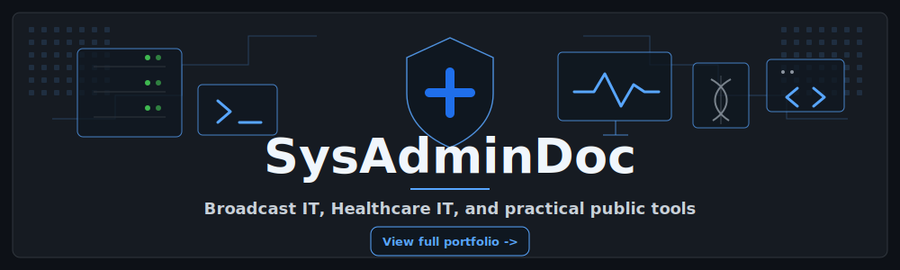

**[View my full portfolio →](https://sysadmindoc.github.io/)**

<picture><source media="(prefers-color-scheme: dark)" srcset="assets/profile/header-dark.svg"><source media="(prefers-color-scheme: light)" srcset="assets/profile/header-light.svg"></picture>

### Featured Projects

| Project | Category | Stars | Description | Action |
|:--------|:---------|:-----:|:------------|:------:|
| [**win11-nvme-driver-patcher**](https://github.com/SysAdminDoc/win11-nvme-driver-patcher) | PowerShell | &#11088;46 | GUI to enable Windows Server 2025 NVMe driver on Win11 | [<kbd>&#11015; Download</kbd>](https://github.com/SysAdminDoc/win11-nvme-driver-patcher/releases/latest) |
| [**OpenCut**](https://github.com/SysAdminDoc/OpenCut) | Python | &#11088;21 | AI-powered video editing automation for Premiere Pro — caption generation, audio processing, VFX | [<kbd>&#11015; Download</kbd>](https://github.com/SysAdminDoc/OpenCut/releases/latest) |
| [**project-nomad-desktop**](https://github.com/SysAdminDoc/project-nomad-desktop) | Python | &#11088;11 | Offline survival command center — maps, AI chat, situation room, NukeMap, supply tracking | [<kbd>&#11015; Download</kbd>](https://github.com/SysAdminDoc/project-nomad-desktop/releases/latest) |
| [**LibreSpot**](https://github.com/SysAdminDoc/LibreSpot) | PowerShell | &#11088;12 | Spotify customization — automates Spicetify, themes, extensions | [<kbd>&#11015; Download</kbd>](https://github.com/SysAdminDoc/LibreSpot/releases/latest) |
| [**VideoSubtitleRemover**](https://github.com/SysAdminDoc/VideoSubtitleRemover) | Media | &#11088;20 | Remove hardcoded subtitles from video | [<kbd>&#11015; Download</kbd>](https://github.com/SysAdminDoc/VideoSubtitleRemover/releases/latest) |
| [**Astra-Deck**](https://github.com/SysAdminDoc/Astra-Deck) | Extensions | &#11088;10 | Premium YouTube enhancement extension — 150+ features for Chrome & Firefox | [<kbd>&#11015; CRX/XPI</kbd>](https://github.com/SysAdminDoc/Astra-Deck/releases/latest) |
| [**Network_Security_Auditor**](https://github.com/SysAdminDoc/Network_Security_Auditor) | PowerShell | &#11088;6 | 67 automated checks across 8 security domains, MITRE ATT&CK mapping | [<kbd>&#11015; Download</kbd>](https://github.com/SysAdminDoc/Network_Security_Auditor/releases/latest) |
| [**ZeusWatch**](https://github.com/SysAdminDoc/ZeusWatch) | Android | &#11088;7 | Premium dark weather app — no API keys required | [<kbd>&#11015; APK</kbd>](https://github.com/SysAdminDoc/ZeusWatch/releases/latest) |
| [**NovaCut**](https://github.com/SysAdminDoc/NovaCut) | Android | &#11088;13 | Professional video editor — 40+ effects, 37 transitions, 29 engines | [<kbd>&#11015; APK</kbd>](https://github.com/SysAdminDoc/NovaCut/releases/latest) |
| [**HostShield**](https://github.com/SysAdminDoc/HostShield) | Android | &#11088;11 | AMOLED-dark hosts-based ad blocker — inspired by AdAway | [<kbd>&#11015; APK</kbd>](https://github.com/SysAdminDoc/HostShield/releases/latest) |

---

<details>
<summary><b>&#128190; First-time setup</b> -- <i>New to this? Install Python 3 + Git in one paste.</i></summary>
<br/>

The PowerShell and Python sections clone repos with **Git** and run scripts with **Python 3** when needed. On a fresh Windows machine, open **PowerShell** and paste:

```powershell
irm https://raw.githubusercontent.com/SysAdminDoc/SysAdminDoc/main/setup.ps1 | iex
```

Inspect before installing:

```powershell
$u='https://raw.githubusercontent.com/SysAdminDoc/SysAdminDoc/main/setup.ps1'; $p="$env:TEMP\SysAdminDoc-setup.ps1"; irm $u -OutFile $p; notepad $p; powershell -NoProfile -ExecutionPolicy Bypass -File $p -CheckOnly
```

| Step | Behavior |
|:-----|:---------|
| Checks first | Skips Python or Git when already installed. |
| Inspect before installing | Save the script, review it, then run `-CheckOnly` to report Python, Git, pip, and winget state without installing. |
| Installs with Windows tooling | Uses `winget` for [Python 3.12](https://www.python.org/) and [Git for Windows](https://git-scm.com/). |
| Refreshes the shell | Updates the current `PATH` so the commands below work without reopening PowerShell. |
| Records diagnostics | Writes a best-effort transcript to `%TEMP%\SysAdminDoc-setup-*.log`. |
| Shows its source | [`setup.ps1`](https://github.com/SysAdminDoc/SysAdminDoc/blob/main/setup.ps1) is the exact script being run. |

Already have Python and Git? Skip this and open the category you need.

</details>

<a id="powershell-system-utilities"></a>
<details>
<summary><b>&#9889; PowerShell System Utilities</b> -- 30 repos -- <i>Requires Git (see <b>First-time setup</b> above).</i></summary>
<br/>

Start with: [**win11-nvme-driver-patcher**](https://github.com/SysAdminDoc/win11-nvme-driver-patcher), [**LibreSpot**](https://github.com/SysAdminDoc/LibreSpot), [**Network_Security_Auditor**](https://github.com/SysAdminDoc/Network_Security_Auditor).

[**win11-nvme-driver-patcher**](https://github.com/SysAdminDoc/win11-nvme-driver-patcher) &#11088;46 -- GUI to enable Windows Server 2025 NVMe driver on Win11 &nbsp;[<kbd>&#11015; Download</kbd>](https://github.com/SysAdminDoc/win11-nvme-driver-patcher/releases/latest)
```powershell
$d="$env:TEMP\win11-nvme-driver-patcher"; if(Test-Path $d){git -C $d pull -q}else{git clone -q --depth 1 -b main https://github.com/SysAdminDoc/win11-nvme-driver-patcher $d}; if(Test-Path "$d\requirements.txt"){pip install -q -r "$d\requirements.txt"}; & "$d\NVMe_Driver_Patcher.ps1"
```

[**Network_Security_Auditor**](https://github.com/SysAdminDoc/Network_Security_Auditor) &#11088;6 -- 67 automated checks across 8 security domains, MITRE ATT&CK mapping &nbsp;[<kbd>&#11015; Download</kbd>](https://github.com/SysAdminDoc/Network_Security_Auditor/releases/latest)
```powershell
$d="$env:TEMP\Network_Security_Auditor"; if(Test-Path $d){git -C $d pull -q}else{git clone -q --depth 1 -b main https://github.com/SysAdminDoc/Network_Security_Auditor $d}; if(Test-Path "$d\requirements.txt"){pip install -q -r "$d\requirements.txt"}; & "$d\NetworkSecurityAudit.ps1"
```

[**LibreSpot**](https://github.com/SysAdminDoc/LibreSpot) &#11088;12 -- Spotify customization — automates Spicetify, themes, extensions &nbsp;[<kbd>&#11015; Download</kbd>](https://github.com/SysAdminDoc/LibreSpot/releases/latest)
```powershell
$d="$env:TEMP\LibreSpot"; if(Test-Path $d){git -C $d pull -q}else{git clone -q --depth 1 -b main https://github.com/SysAdminDoc/LibreSpot $d}; if(Test-Path "$d\requirements.txt"){pip install -q -r "$d\requirements.txt"}; & "$d\LibreSpot.ps1"
```

[**WinForge**](https://github.com/SysAdminDoc/WinForge) -- All-in-one Windows provisioning suite — app installer, tweaks, features, updates
```powershell
$d="$env:TEMP\WinForge"; if(Test-Path $d){git -C $d pull -q}else{git clone -q --depth 1 -b main https://github.com/SysAdminDoc/WinForge $d}; if(Test-Path "$d\requirements.txt"){pip install -q -r "$d\requirements.txt"}; & "$d\WinForge.ps1"
```

[**Debloat-Win11**](https://github.com/SysAdminDoc/Debloat-Win11) &#11088;1 -- Enterprise Windows 11 debloating with AppX removal, Office cleanup, telemetry blocking
```powershell
$d="$env:TEMP\Debloat-Win11"; if(Test-Path $d){git -C $d pull -q}else{git clone -q --depth 1 -b main https://github.com/SysAdminDoc/Debloat-Win11 $d}; if(Test-Path "$d\requirements.txt"){pip install -q -r "$d\requirements.txt"}; & "$d\Debloat-Win11.ps1"
```

[**Restore-WindowsDefaults**](https://github.com/SysAdminDoc/Restore-WindowsDefaults) -- Reverse debloat changes and restore Windows to factory defaults
```powershell
$d="$env:TEMP\Restore-WindowsDefaults"; if(Test-Path $d){git -C $d pull -q}else{git clone -q --depth 1 -b main https://github.com/SysAdminDoc/Restore-WindowsDefaults $d}; if(Test-Path "$d\requirements.txt"){pip install -q -r "$d\requirements.txt"}; & "$d\Restore-WindowsDefaults.ps1"
```

[**DefenderControl**](https://github.com/SysAdminDoc/DefenderControl) &#11088;5 -- WPF GUI to fully disable or re-enable Microsoft Defender &nbsp;[<kbd>&#11015; Download</kbd>](https://github.com/SysAdminDoc/DefenderControl/releases/latest)
```powershell
$d="$env:TEMP\DefenderControl"; if(Test-Path $d){git -C $d pull -q}else{git clone -q --depth 1 -b main https://github.com/SysAdminDoc/DefenderControl $d}; if(Test-Path "$d\requirements.txt"){pip install -q -r "$d\requirements.txt"}; & "$d\DefenderControl.ps1"
```

[**DisableDefender**](https://github.com/SysAdminDoc/DisableDefender) &#11088;9 -- Defender disabler/remover with CLI + premium WPF GUI; firewall preserved &nbsp;[<kbd>&#11015; Download</kbd>](https://github.com/SysAdminDoc/DisableDefender/releases/latest)
```powershell
$d="$env:TEMP\DisableDefender"; if(Test-Path $d){git -C $d pull -q}else{git clone -q --depth 1 -b main https://github.com/SysAdminDoc/DisableDefender $d}; if(Test-Path "$d\requirements.txt"){pip install -q -r "$d\requirements.txt"}; & "$d\DisableDefender.ps1"
```

[**DefenderShield**](https://github.com/SysAdminDoc/DefenderShield) -- Repair and restore Windows Defender and Firewall after debloaters
```powershell
$d="$env:TEMP\DefenderShield"; if(Test-Path $d){git -C $d pull -q}else{git clone -q --depth 1 -b main https://github.com/SysAdminDoc/DefenderShield $d}; if(Test-Path "$d\requirements.txt"){pip install -q -r "$d\requirements.txt"}; & "$d\DefenderShield.ps1"
```

[**TelemetrySlayer**](https://github.com/SysAdminDoc/TelemetrySlayer) -- WPF GUI to disable Windows telemetry, data collection, and compatibility bloat
```powershell
$d="$env:TEMP\TelemetrySlayer"; if(Test-Path $d){git -C $d pull -q}else{git clone -q --depth 1 -b main https://github.com/SysAdminDoc/TelemetrySlayer $d}; if(Test-Path "$d\requirements.txt"){pip install -q -r "$d\requirements.txt"}; & "$d\TelemetrySlayer.ps1"
```

[**FirewallForge**](https://github.com/SysAdminDoc/FirewallForge) -- WPF Windows Firewall manager with live rule editing and offline backup editor
```powershell
$d="$env:TEMP\FirewallForge"; if(Test-Path $d){git -C $d pull -q}else{git clone -q --depth 1 -b main https://github.com/SysAdminDoc/FirewallForge $d}; if(Test-Path "$d\requirements.txt"){pip install -q -r "$d\requirements.txt"}; & "$d\FirewallManager.ps1"
```

[**NetForge**](https://github.com/SysAdminDoc/NetForge) &#11088;2 -- WPF network adapter manager — static/DHCP, DNS presets, profile management
```powershell
$d="$env:TEMP\NetForge"; if(Test-Path $d){git -C $d pull -q}else{git clone -q --depth 1 -b main https://github.com/SysAdminDoc/NetForge $d}; if(Test-Path "$d\requirements.txt"){pip install -q -r "$d\requirements.txt"}; & "$d\NetForge.ps1"
```

[**SystemUpdatePro**](https://github.com/SysAdminDoc/SystemUpdatePro) -- Enterprise Windows update automation — OEM drivers, Windows Update, winget
```powershell
$d="$env:TEMP\SystemUpdatePro"; if(Test-Path $d){git -C $d pull -q}else{git clone -q --depth 1 -b main https://github.com/SysAdminDoc/SystemUpdatePro $d}; if(Test-Path "$d\requirements.txt"){pip install -q -r "$d\requirements.txt"}; & "$d\SystemUpdatePro.ps1"
```

[**WURepair**](https://github.com/SysAdminDoc/WURepair) &#11088;2 -- Comprehensive Windows Update component repair — DLL re-registration, DISM, SFC, network reset
```powershell
$d="$env:TEMP\WURepair"; if(Test-Path $d){git -C $d pull -q}else{git clone -q --depth 1 -b main https://github.com/SysAdminDoc/WURepair $d}; if(Test-Path "$d\requirements.txt"){pip install -q -r "$d\requirements.txt"}; & "$d\WURepair.ps1"
```

[**SoftwareScannerGUI**](https://github.com/SysAdminDoc/SoftwareScannerGUI) -- WPF audit tool for installed software — AppX, Win32, services, tasks, startup entries
```powershell
$d="$env:TEMP\SoftwareScannerGUI"; if(Test-Path $d){git -C $d pull -q}else{git clone -q --depth 1 -b main https://github.com/SysAdminDoc/SoftwareScannerGUI $d}; if(Test-Path "$d\requirements.txt"){pip install -q -r "$d\requirements.txt"}; & "$d\SoftwareScannerGUI.ps1"
```

[**NuclearDellRemover**](https://github.com/SysAdminDoc/NuclearDellRemover) &#11088;1 -- Scorched-earth Dell bloatware removal — 8-phase complete cleanup &nbsp;[<kbd>&#11015; Download</kbd>](https://github.com/SysAdminDoc/NuclearDellRemover/releases/latest)
```powershell
$d="$env:TEMP\NuclearDellRemover"; if(Test-Path $d){git -C $d pull -q}else{git clone -q --depth 1 -b main https://github.com/SysAdminDoc/NuclearDellRemover $d}; if(Test-Path "$d\requirements.txt"){pip install -q -r "$d\requirements.txt"}; & "$d\NuclearDellRemover.ps1"
```

[**Disable-AdobeTelemetry**](https://github.com/SysAdminDoc/Disable-AdobeTelemetry) &#11088;1 -- Comprehensive Adobe telemetry and GrowthSDK suppression for Windows
```powershell
$d="$env:TEMP\Disable-AdobeTelemetry"; if(Test-Path $d){git -C $d pull -q}else{git clone -q --depth 1 -b main https://github.com/SysAdminDoc/Disable-AdobeTelemetry $d}; if(Test-Path "$d\requirements.txt"){pip install -q -r "$d\requirements.txt"}; & "$d\Disable-AdobeTelemetry.ps1"
```

[**Wingetter**](https://github.com/SysAdminDoc/Wingetter) &#11088;2 -- Discover, select, and bulk install software via Winget &nbsp;[<kbd>&#11015; Download</kbd>](https://github.com/SysAdminDoc/Wingetter/releases/latest)
```powershell
$d="$env:TEMP\Wingetter"; if(Test-Path $d){git -C $d pull -q}else{git clone -q --depth 1 -b main https://github.com/SysAdminDoc/Wingetter $d}; if(Test-Path "$d\requirements.txt"){pip install -q -r "$d\requirements.txt"}; & "$d\Wingetter.ps1"
```

[**Start-Menu-Organizer**](https://github.com/SysAdminDoc/Start-Menu-Organizer) &#11088;1 -- Clean junk, detect broken shortcuts, reorganize Start Menu
```powershell
$d="$env:TEMP\Start-Menu-Organizer"; if(Test-Path $d){git -C $d pull -q}else{git clone -q --depth 1 -b main https://github.com/SysAdminDoc/Start-Menu-Organizer $d}; if(Test-Path "$d\requirements.txt"){pip install -q -r "$d\requirements.txt"}; & "$d\StartMenuOrganizerPro.ps1"
```

[**PathForge**](https://github.com/SysAdminDoc/PathForge) -- Filesystem repair, stubborn file deletion, path management &nbsp;[<kbd>&#11015; Download</kbd>](https://github.com/SysAdminDoc/PathForge/releases/latest)
```powershell
$d="$env:TEMP\PathForge"; if(Test-Path $d){git -C $d pull -q}else{git clone -q --depth 1 -b main https://github.com/SysAdminDoc/PathForge $d}; if(Test-Path "$d\requirements.txt"){pip install -q -r "$d\requirements.txt"}; & "$d\PathForge.ps1"
```

[**MonitorControl**](https://github.com/SysAdminDoc/MonitorControl) &#11088;1 -- Control monitor settings via DDC/CI &nbsp;[<kbd>&#11015; Download</kbd>](https://github.com/SysAdminDoc/MonitorControl/releases/latest)
```powershell
$d="$env:TEMP\MonitorControl"; if(Test-Path $d){git -C $d pull -q}else{git clone -q --depth 1 -b main https://github.com/SysAdminDoc/MonitorControl $d}; if(Test-Path "$d\requirements.txt"){pip install -q -r "$d\requirements.txt"}; & "$d\MonitorControlPro.ps1"
```

[**WallBrand**](https://github.com/SysAdminDoc/WallBrand) -- Wallpaper branding tool with GUI and CLI modes
```powershell
$d="$env:TEMP\WallBrand"; if(Test-Path $d){git -C $d pull -q}else{git clone -q --depth 1 -b main https://github.com/SysAdminDoc/WallBrand $d}; if(Test-Path "$d\requirements.txt"){pip install -q -r "$d\requirements.txt"}; & "$d\WallBrandPro.ps1"
```

[**VoidTools-Everything-Settings-Manager**](https://github.com/SysAdminDoc/VoidTools-Everything-Settings-Manager) -- GUI for managing VoidTools Everything settings, INI editing, CSV filter/bookmark management
```powershell
$d="$env:TEMP\VoidTools-Everything-Settings-Manager"; if(Test-Path $d){git -C $d pull -q}else{git clone -q --depth 1 -b main https://github.com/SysAdminDoc/VoidTools-Everything-Settings-Manager $d}; if(Test-Path "$d\requirements.txt"){pip install -q -r "$d\requirements.txt"}; & "$d\EverythingSettingsManager.ps1"
```

[**PfblockerngManager**](https://github.com/SysAdminDoc/PfblockerngManager) -- GUI for managing pfBlockerNG on pfSense firewalls
```powershell
$d="$env:TEMP\PfblockerngManager"; if(Test-Path $d){git -C $d pull -q}else{git clone -q --depth 1 -b main https://github.com/SysAdminDoc/PfblockerngManager $d}; if(Test-Path "$d\requirements.txt"){pip install -q -r "$d\requirements.txt"}; & "$d\pfBlockerNG-Manager.ps1"
```

[**npp-sc-scanner**](https://github.com/SysAdminDoc/npp-sc-scanner) -- Detect and remediate Notepad++ supply chain attack IOCs
```powershell
$d="$env:TEMP\npp-sc-scanner"; if(Test-Path $d){git -C $d pull -q}else{git clone -q --depth 1 -b main https://github.com/SysAdminDoc/npp-sc-scanner $d}; if(Test-Path "$d\requirements.txt"){pip install -q -r "$d\requirements.txt"}; & "$d\NppScanner-GUI.ps1"
```

[**JDownloader-2-Ultimate-Manager**](https://github.com/SysAdminDoc/JDownloader-2-Ultimate-Manager) -- Comprehensive automation for JDownloader 2 &nbsp;[<kbd>&#11015; Download</kbd>](https://github.com/SysAdminDoc/JDownloader-2-Ultimate-Manager/releases/latest)
```powershell
$d="$env:TEMP\JDownloader-2-Ultimate-Manager"; if(Test-Path $d){git -C $d pull -q}else{git clone -q --depth 1 -b main https://github.com/SysAdminDoc/JDownloader-2-Ultimate-Manager $d}; if(Test-Path "$d\requirements.txt"){pip install -q -r "$d\requirements.txt"}; & "$d\JDownloader 2 Ultimate Manager.ps1"
```

[**ThankYouJeffrey**](https://github.com/SysAdminDoc/ThankYouJeffrey) -- A tribute to the creator of PowerShell, Jeffrey Snover
```powershell
$d="$env:TEMP\ThankYouJeffrey"; if(Test-Path $d){git -C $d pull -q}else{git clone -q --depth 1 -b main https://github.com/SysAdminDoc/ThankYouJeffrey $d}; if(Test-Path "$d\requirements.txt"){pip install -q -r "$d\requirements.txt"}; & "$d\ThankYouJeffrey.ps1"
```

[**EXTRACTORX**](https://github.com/SysAdminDoc/EXTRACTORX) &#11088;1 -- Open-source bulk archive extraction tool for Windows &nbsp;[<kbd>&#11015; Download</kbd>](https://github.com/SysAdminDoc/EXTRACTORX/releases/latest)
```powershell
$d="$env:TEMP\EXTRACTORX"; if(Test-Path $d){git -C $d pull -q}else{git clone -q --depth 1 -b main https://github.com/SysAdminDoc/EXTRACTORX $d}; if(Test-Path "$d\requirements.txt"){pip install -q -r "$d\requirements.txt"}; & "$d\ExtractorX.ps1"
```

[**AdapterLock**](https://github.com/SysAdminDoc/AdapterLock) -- Per-adapter IP lockdown for Windows -- WPF GUI, CLI mode, policy export, and event-log auditing
```powershell
$d="$env:TEMP\AdapterLock"; if(Test-Path $d){git -C $d pull -q}else{git clone -q --depth 1 -b master https://github.com/SysAdminDoc/AdapterLock $d}; if(Test-Path "$d\requirements.txt"){pip install -q -r "$d\requirements.txt"}; & "$d\AdapterLock.ps1"
```

[**Brave-Portable-Updater**](https://github.com/SysAdminDoc/Brave-Portable-Updater) -- Update Brave inside a Portapps portable install without touching system install
```powershell
$d="$env:TEMP\Brave-Portable-Updater"; if(Test-Path $d){git -C $d pull -q}else{git clone -q --depth 1 -b main https://github.com/SysAdminDoc/Brave-Portable-Updater $d}; if(Test-Path "$d\requirements.txt"){pip install -q -r "$d\requirements.txt"}; & "$d\Update-BravePortable.ps1"
```

</details>

<a id="python-desktop-applications"></a>
<details>
<summary><b>&#128013; Python Desktop Applications</b> -- 30 repos -- <i>Requires Python 3.8+ and Git (see <b>First-time setup</b> above). Each one-liner shallow-clones the repo to <code>$env:TEMP</code>, installs <code>requirements.txt</code> if present, then runs the entry script.</i></summary>
<br/>

Start with: [**OpenCut**](https://github.com/SysAdminDoc/OpenCut), [**project-nomad-desktop**](https://github.com/SysAdminDoc/project-nomad-desktop), [**Vertigo**](https://github.com/SysAdminDoc/Vertigo).

[**project-nomad-desktop**](https://github.com/SysAdminDoc/project-nomad-desktop) &#11088;11 -- Offline survival command center — maps, AI chat, situation room, NukeMap, supply tracking &nbsp;[<kbd>&#11015; Download</kbd>](https://github.com/SysAdminDoc/project-nomad-desktop/releases/latest)
```powershell
$d="$env:TEMP\project-nomad-desktop"; if(Test-Path $d){git -C $d pull -q}else{git clone -q --depth 1 -b master https://github.com/SysAdminDoc/project-nomad-desktop $d}; if(Test-Path "$d\requirements.txt"){pip install -q -r "$d\requirements.txt"}; python "$d\nomad.py"
```

[**Vertigo**](https://github.com/SysAdminDoc/Vertigo) &#11088;1 -- Vertical video studio for short-form creators — turns raw footage into polished 9:16 for Shorts/TikTok/Reels &nbsp;[<kbd>&#11015; Download</kbd>](https://github.com/SysAdminDoc/Vertigo/releases/latest)
```powershell
$d="$env:TEMP\Vertigo"; if(Test-Path $d){git -C $d pull -q}else{git clone -q --depth 1 -b main https://github.com/SysAdminDoc/Vertigo $d}; if(Test-Path "$d\requirements.txt"){pip install -q -r "$d\requirements.txt"}; python "$d\vertigo.py"
```

[**PromptCompanion**](https://github.com/SysAdminDoc/PromptCompanion) &#11088;1 -- A curated, searchable, offline library of the best AI prompts &nbsp;[<kbd>&#11015; Download</kbd>](https://github.com/SysAdminDoc/PromptCompanion/releases/latest)
```powershell
$d="$env:TEMP\PromptCompanion"; if(Test-Path $d){git -C $d pull -q}else{git clone -q --depth 1 -b main https://github.com/SysAdminDoc/PromptCompanion $d}; if(Test-Path "$d\requirements.txt"){pip install -q -r "$d\requirements.txt"}; python "$d\promptcompanion.py"
```

[**SunoJump**](https://github.com/SysAdminDoc/SunoJump) &#11088;3 -- Audio fingerprint masking for Suno AI — 10-pass pipeline, PyQt6 GUI, batch processing &nbsp;[<kbd>&#11015; Download</kbd>](https://github.com/SysAdminDoc/SunoJump/releases/latest)
```powershell
$d="$env:TEMP\SunoJump"; if(Test-Path $d){git -C $d pull -q}else{git clone -q --depth 1 -b main https://github.com/SysAdminDoc/SunoJump $d}; if(Test-Path "$d\requirements.txt"){pip install -q -r "$d\requirements.txt"}; python "$d\sunojump.py"
```

[**PyWall**](https://github.com/SysAdminDoc/PyWall) -- Real-time Windows Firewall manager and network monitor &nbsp;[<kbd>&#11015; Download</kbd>](https://github.com/SysAdminDoc/PyWall/releases/latest)
```powershell
$d="$env:TEMP\PyWall"; if(Test-Path $d){git -C $d pull -q}else{git clone -q --depth 1 -b main https://github.com/SysAdminDoc/PyWall $d}; if(Test-Path "$d\requirements.txt"){pip install -q -r "$d\requirements.txt"}; python "$d\PyWall.py"
```

[**HostsGuard**](https://github.com/SysAdminDoc/HostsGuard) -- Real-time network privacy manager — DNS monitoring, hosts file management, firewall rules &nbsp;[<kbd>&#11015; Download</kbd>](https://github.com/SysAdminDoc/HostsGuard/releases/latest)
```powershell
$d="$env:TEMP\HostsGuard"; if(Test-Path $d){git -C $d pull -q}else{git clone -q --depth 1 -b main https://github.com/SysAdminDoc/HostsGuard $d}; if(Test-Path "$d\requirements.txt"){pip install -q -r "$d\requirements.txt"}; python "$d\HostsGuard.py"
```

[**PyShop**](https://github.com/SysAdminDoc/PyShop) &#11088;3 -- Open source Photoshop alternative
```powershell
$d="$env:TEMP\PyShop"; if(Test-Path $d){git -C $d pull -q}else{git clone -q --depth 1 -b main https://github.com/SysAdminDoc/PyShop $d}; if(Test-Path "$d\requirements.txt"){pip install -q -r "$d\requirements.txt"}; python "$d\pyshop_image_editor.py"
```

[**SwiftShot**](https://github.com/SysAdminDoc/SwiftShot) -- Debloated, Greenshot-inspired screenshot tool &nbsp;[<kbd>&#11015; Download</kbd>](https://github.com/SysAdminDoc/SwiftShot/releases/latest)
```powershell
$d="$env:TEMP\SwiftShot"; if(Test-Path $d){git -C $d pull -q}else{git clone -q --depth 1 -b main https://github.com/SysAdminDoc/SwiftShot $d}; if(Test-Path "$d\requirements.txt"){pip install -q -r "$d\requirements.txt"}; & "$d\App\Install-SwiftShot.ps1"
```

[**GitForge**](https://github.com/SysAdminDoc/GitForge) -- Full GitHub repo manager — clone, sync, diff, manage &nbsp;[<kbd>&#11015; Download</kbd>](https://github.com/SysAdminDoc/GitForge/releases/latest)
```powershell
$d="$env:TEMP\GitForge"; if(Test-Path $d){git -C $d pull -q}else{git clone -q --depth 1 -b main https://github.com/SysAdminDoc/GitForge $d}; if(Test-Path "$d\requirements.txt"){pip install -q -r "$d\requirements.txt"}; python "$d\gitforge.py"
```

[**UniFile**](https://github.com/SysAdminDoc/UniFile) &#11088;2 -- AI-powered unified file organization — 5 engines, tag-based library, LLM integration &nbsp;[<kbd>&#11015; Download</kbd>](https://github.com/SysAdminDoc/UniFile/releases/latest)
```powershell
$d="$env:TEMP\UniFile"; if(Test-Path $d){git -C $d pull -q}else{git clone -q --depth 1 -b master https://github.com/SysAdminDoc/UniFile $d}; if(Test-Path "$d\requirements.txt"){pip install -q -r "$d\requirements.txt"}; python "$d\run.py"
```

[**QuickFind**](https://github.com/SysAdminDoc/QuickFind) &#11088;1 -- Lightning-fast file search for Windows — reads NTFS MFT directly &nbsp;[<kbd>&#11015; Download</kbd>](https://github.com/SysAdminDoc/QuickFind/releases/latest)
```powershell
$d="$env:TEMP\QuickFind"; if(Test-Path $d){git -C $d pull -q}else{git clone -q --depth 1 -b main https://github.com/SysAdminDoc/QuickFind $d}; if(Test-Path "$d\requirements.txt"){pip install -q -r "$d\requirements.txt"}; python "$d\quickfind.py"
```

[**FileOrganizer**](https://github.com/SysAdminDoc/FileOrganizer) &#11088;2 -- AI-powered desktop tool for classifying and organizing design asset folders &nbsp;[<kbd>&#11015; Download</kbd>](https://github.com/SysAdminDoc/FileOrganizer/releases/latest)
```powershell
$d="$env:TEMP\FileOrganizer"; if(Test-Path $d){git -C $d pull -q}else{git clone -q --depth 1 -b main https://github.com/SysAdminDoc/FileOrganizer $d}; if(Test-Path "$d\requirements.txt"){pip install -q -r "$d\requirements.txt"}; python "$d\run.py"
```

[**HEICShift**](https://github.com/SysAdminDoc/HEICShift) &#11088;1 -- High-performance HEIC/HEIF batch converter with PyQt6 GUI, parallel conversion, metadata preservation &nbsp;[<kbd>&#11015; Download</kbd>](https://github.com/SysAdminDoc/HEICShift/releases/latest)
```powershell
$d="$env:TEMP\HEICShift"; if(Test-Path $d){git -C $d pull -q}else{git clone -q --depth 1 -b master https://github.com/SysAdminDoc/HEICShift $d}; if(Test-Path "$d\requirements.txt"){pip install -q -r "$d\requirements.txt"}; python "$d\heicshift.py"
```

[**FrameSnap**](https://github.com/SysAdminDoc/FrameSnap) -- Browse MP4 videos, mark frames visually, and export precise screenshots &nbsp;[<kbd>&#11015; Download</kbd>](https://github.com/SysAdminDoc/FrameSnap/releases/latest)
```powershell
$d="$env:TEMP\FrameSnap"; if(Test-Path $d){git -C $d pull -q}else{git clone -q --depth 1 -b main https://github.com/SysAdminDoc/FrameSnap $d}; if(Test-Path "$d\requirements.txt"){pip install -q -r "$d\requirements.txt"}; python "$d\framesnap.py"
```

[**ExplorerTweaks**](https://github.com/SysAdminDoc/ExplorerTweaks) &#11088;1 -- GUI for toggling 50+ Windows File Explorer registry settings with live preview
```powershell
$d="$env:TEMP\ExplorerTweaks"; if(Test-Path $d){git -C $d pull -q}else{git clone -q --depth 1 -b main https://github.com/SysAdminDoc/ExplorerTweaks $d}; if(Test-Path "$d\requirements.txt"){pip install -q -r "$d\requirements.txt"}; python "$d\explorer_tweaks.py"
```

[**FaceSlim**](https://github.com/SysAdminDoc/FaceSlim) &#11088;2 -- AI face slimming, reshaping, and beautification with real-time preview and GPU acceleration
```powershell
$d="$env:TEMP\FaceSlim"; if(Test-Path $d){git -C $d pull -q}else{git clone -q --depth 1 -b main https://github.com/SysAdminDoc/FaceSlim $d}; if(Test-Path "$d\requirements.txt"){pip install -q -r "$d\requirements.txt"}; python "$d\FaceSlim.py"
```

[**LlamaLink**](https://github.com/SysAdminDoc/LlamaLink) -- Sleek GUI frontend for llama.cpp — search, download, and chat with local LLMs &nbsp;[<kbd>&#11015; Download</kbd>](https://github.com/SysAdminDoc/LlamaLink/releases/latest)
```powershell
$d="$env:TEMP\LlamaLink"; if(Test-Path $d){git -C $d pull -q}else{git clone -q --depth 1 -b master https://github.com/SysAdminDoc/LlamaLink $d}; if(Test-Path "$d\requirements.txt"){pip install -q -r "$d\requirements.txt"}; python "$d\llamalink.py"
```

[**SlunderStudio**](https://github.com/SysAdminDoc/SlunderStudio) &#11088;3 -- Offline AI music generation suite — song creation, lyrics, MIDI, vocals, stem separation, mastering
```powershell
$d="$env:TEMP\SlunderStudio"; if(Test-Path $d){git -C $d pull -q}else{git clone -q --depth 1 -b main https://github.com/SysAdminDoc/SlunderStudio $d}; if(Test-Path "$d\requirements.txt"){pip install -q -r "$d\requirements.txt"}; python "$d\main.py"
```

[**OpenCut**](https://github.com/SysAdminDoc/OpenCut) &#11088;21 -- AI-powered video editing automation for Premiere Pro — caption generation, audio processing, VFX &nbsp;[<kbd>&#11015; Download</kbd>](https://github.com/SysAdminDoc/OpenCut/releases/latest)
```powershell
$d="$env:TEMP\OpenCut"; if(Test-Path $d){git -C $d pull -q}else{git clone -q --depth 1 -b main https://github.com/SysAdminDoc/OpenCut $d}; if(Test-Path "$d\requirements.txt"){pip install -q -r "$d\requirements.txt"}; & "$d\Install.ps1"
```

[**MSStoreHelper**](https://github.com/SysAdminDoc/MSStoreHelper) &#11088;3 -- Install Microsoft Store apps without the Store &nbsp;[<kbd>&#11015; Download</kbd>](https://github.com/SysAdminDoc/MSStoreHelper/releases/latest)
```powershell
$d="$env:TEMP\MSStoreHelper"; if(Test-Path $d){git -C $d pull -q}else{git clone -q --depth 1 -b main https://github.com/SysAdminDoc/MSStoreHelper $d}; if(Test-Path "$d\requirements.txt"){pip install -q -r "$d\requirements.txt"}; python "$d\MSStoreHelper.py"
```

[**Qwen3-TTS-Studio**](https://github.com/SysAdminDoc/Qwen3-TTS-Studio) -- AI voice generator powered by Qwen3-TTS &nbsp;[<kbd>&#11015; Download</kbd>](https://github.com/SysAdminDoc/Qwen3-TTS-Studio/releases/latest)
```powershell
$d="$env:TEMP\Qwen3-TTS-Studio"; if(Test-Path $d){git -C $d pull -q}else{git clone -q --depth 1 -b main https://github.com/SysAdminDoc/Qwen3-TTS-Studio $d}; if(Test-Path "$d\requirements.txt"){pip install -q -r "$d\requirements.txt"}; python "$d\qwen3_tts_studio.py"
```

[**AppList**](https://github.com/SysAdminDoc/AppList) &#11088;1 -- Scan, catalog, and export all installed applications &nbsp;[<kbd>&#11015; Download</kbd>](https://github.com/SysAdminDoc/AppList/releases/latest)
```powershell
$d="$env:TEMP\AppList"; if(Test-Path $d){git -C $d pull -q}else{git clone -q --depth 1 -b main https://github.com/SysAdminDoc/AppList $d}; if(Test-Path "$d\requirements.txt"){pip install -q -r "$d\requirements.txt"}; python "$d\AppList.py"
```

[**Mattpad**](https://github.com/SysAdminDoc/Mattpad) -- Minimal notepad built for personal workflow &nbsp;[<kbd>&#11015; Download</kbd>](https://github.com/SysAdminDoc/Mattpad/releases/latest)
```powershell
$d="$env:TEMP\Mattpad"; if(Test-Path $d){git -C $d pull -q}else{git clone -q --depth 1 -b main https://github.com/SysAdminDoc/Mattpad $d}; if(Test-Path "$d\requirements.txt"){pip install -q -r "$d\requirements.txt"}; python "$d\mattpad.py"
```

[**HostsFileGet**](https://github.com/SysAdminDoc/HostsFileGet) -- GUI for managing the Windows hosts file &nbsp;[<kbd>&#11015; Download</kbd>](https://github.com/SysAdminDoc/HostsFileGet/releases/latest)
```powershell
$d="$env:TEMP\HostsFileGet"; if(Test-Path $d){git -C $d pull -q}else{git clone -q --depth 1 -b main https://github.com/SysAdminDoc/HostsFileGet $d}; if(Test-Path "$d\requirements.txt"){pip install -q -r "$d\requirements.txt"}; & "$d\PythonLauncher.ps1"
```

[**Bookmark-Organizer-Pro**](https://github.com/SysAdminDoc/Bookmark-Organizer-Pro) &#11088;4 -- AI-powered bookmark manager and categorizer &nbsp;[<kbd>&#11015; Download</kbd>](https://github.com/SysAdminDoc/Bookmark-Organizer-Pro/releases/latest)
```powershell
$d="$env:TEMP\Bookmark-Organizer-Pro"; if(Test-Path $d){git -C $d pull -q}else{git clone -q --depth 1 -b main https://github.com/SysAdminDoc/Bookmark-Organizer-Pro $d}; if(Test-Path "$d\requirements.txt"){pip install -q -r "$d\requirements.txt"}; python "$d\main.py"
```

[**uBlock-Stylus-Converter**](https://github.com/SysAdminDoc/uBlock-Stylus-Converter) -- Convert uBlock cosmetic filters to Stylus CSS &nbsp;[<kbd>&#11015; Download</kbd>](https://github.com/SysAdminDoc/uBlock-Stylus-Converter/releases/latest)
```powershell
$d="$env:TEMP\uBlock-Stylus-Converter"; if(Test-Path $d){git -C $d pull -q}else{git clone -q --depth 1 -b main https://github.com/SysAdminDoc/uBlock-Stylus-Converter $d}; if(Test-Path "$d\requirements.txt"){pip install -q -r "$d\requirements.txt"}; python "$d\ublocktoCSS.py"
```

[**KeepSyncNotes**](https://github.com/SysAdminDoc/KeepSyncNotes) &#11088;1 -- Google Keep importer and note tracker
```powershell
$d="$env:TEMP\KeepSyncNotes"; if(Test-Path $d){git -C $d pull -q}else{git clone -q --depth 1 -b main https://github.com/SysAdminDoc/KeepSyncNotes $d}; if(Test-Path "$d\requirements.txt"){pip install -q -r "$d\requirements.txt"}; python "$d\keepsync_notes.py"
```

[**AI-Model-Compass**](https://github.com/SysAdminDoc/AI-Model-Compass) -- Discover, download, and run local AI models tailored to your hardware &nbsp;[<kbd>&#11015; Download</kbd>](https://github.com/SysAdminDoc/AI-Model-Compass/releases/latest)
```powershell
$d="$env:TEMP\AI-Model-Compass"; if(Test-Path $d){git -C $d pull -q}else{git clone -q --depth 1 -b main https://github.com/SysAdminDoc/AI-Model-Compass $d}; if(Test-Path "$d\requirements.txt"){pip install -q -r "$d\requirements.txt"}; python "$d\ai_model_compass.py"
```

[**GifText**](https://github.com/SysAdminDoc/GifText) &#11088;1 -- Animated GIF text editor for meme creation
```powershell
$d="$env:TEMP\GifText"; if(Test-Path $d){git -C $d pull -q}else{git clone -q --depth 1 -b main https://github.com/SysAdminDoc/GifText $d}; if(Test-Path "$d\requirements.txt"){pip install -q -r "$d\requirements.txt"}; python "$d\GifText.py"
```

[**FoxPort**](https://github.com/SysAdminDoc/FoxPort) -- Migrate passwords, bookmarks, and extensions from Chromium browsers to Firefox &nbsp;[<kbd>&#11015; ZIP</kbd>](https://github.com/SysAdminDoc/FoxPort/releases/latest)

</details>

<a id="web-applications"></a>
<details>
<summary><b>&#127760; Web Applications</b> -- 27 repos -- <i>Click to open in browser, no install needed.</i></summary>
<br/>

Start with: [**Openshop**](https://github.com/SysAdminDoc/Openshop), [**StormviewRadar**](https://github.com/SysAdminDoc/StormviewRadar), [**SkyTrack**](https://github.com/SysAdminDoc/SkyTrack).

| Project | Description | Live |
|:--------|:------------|:----:|
| [**Openshop**](https://github.com/SysAdminDoc/Openshop) &#11088;1 | Free browser-based image editor - layers, smart effects, PSD import | [Launch](https://sysadmindoc.github.io/Openshop/) |
| [**StormviewRadar**](https://github.com/SysAdminDoc/StormviewRadar) | Open source weather radar viewer | [Launch](https://sysadmindoc.github.io/StormviewRadar/) |
| [**SkyTrack**](https://github.com/SysAdminDoc/SkyTrack) &#11088;1 | Real-time aircraft tracker — commercial, military, helicopters | [Launch](https://sysadmindoc.github.io/SkyTrack/) |
| [**VIPTrack**](https://github.com/SysAdminDoc/VIPTrack) | Military and VIP aircraft tracker | [Launch](https://sysadmindoc.github.io/VIPTrack/) |
| [**NukeMap**](https://github.com/SysAdminDoc/NukeMap) | Nuclear weapon effects simulator — blast waves, WW3 simulation, 418 targets | [Launch](https://sysadmindoc.github.io/NukeMap/) |
| [**SPECTRE**](https://github.com/SysAdminDoc/SPECTRE) | Intelligence aggregator platform | [Launch](https://sysadmindoc.github.io/SPECTRE/) |
| [**CoolSites**](https://github.com/SysAdminDoc/CoolSites) | Curated directory of 470+ free tools and open source projects | [Launch](https://sysadmindoc.github.io/CoolSites/) |
| [**Multistreamer**](https://github.com/SysAdminDoc/Multistreamer) | Multi-video streaming viewer with chat | [Launch](https://sysadmindoc.github.io/Multistreamer/) |
| [**GifStudio**](https://github.com/SysAdminDoc/GifStudio) | Browser-based GIF creation and editing studio — 100% client-side | [Launch](https://sysadmindoc.github.io/GifStudio/) |
| [**ImageForge**](https://github.com/SysAdminDoc/ImageForge) | Open source image converter | [Launch](https://sysadmindoc.github.io/ImageForge/) |
| [**ClipForge**](https://github.com/SysAdminDoc/ClipForge) | Browser-based video editor powered by FFmpeg.wasm | [Launch](https://sysadmindoc.github.io/ClipForge/) |
| [**ConvertFlow**](https://github.com/SysAdminDoc/ConvertFlow) | Browser-based media converter — audio, video, image — no uploads | [Launch](https://sysadmindoc.github.io/ConvertFlow/) |
| [**IconForge**](https://github.com/SysAdminDoc/IconForge) &#11088;1 | Browser-based image resizer and converter | [Launch](https://sysadmindoc.github.io/IconForge/) |
| [**Base64Converter**](https://github.com/SysAdminDoc/Base64Converter) | Base64 encoding/decoding with file, text, QR code, and image support | [Launch](https://sysadmindoc.github.io/Base64Converter/) |
| [**ImageXpert**](https://github.com/SysAdminDoc/ImageXpert) | Multi-engine reverse image search — Google Lens, Yandex, Bing, TinEye | [Launch](https://sysadmindoc.github.io/ImageXpert/) |
| [**BookmarkVault**](https://github.com/SysAdminDoc/BookmarkVault) | Bookmark management web app | [Launch](https://sysadmindoc.github.io/BookmarkVault/) |
| [**Text-Filter-Editor**](https://github.com/SysAdminDoc/Text-Filter-Editor) | Text filtering and processing tool | [Launch](https://sysadmindoc.github.io/Text-Filter-Editor/) |
| [**kindred**](https://github.com/SysAdminDoc/kindred) | Compatibility-first dating and social platform | [Repo](https://github.com/SysAdminDoc/kindred) |
| [**DeGoogler**](https://github.com/SysAdminDoc/DeGoogler) | Turnkey migration toolkit for leaving Google services | [Launch](https://sysadmindoc.github.io/DeGoogler/) |
| [**SearchHub**](https://github.com/SysAdminDoc/SearchHub) | Search 538 engines across 29 categories | [Launch](https://sysadmindoc.github.io/SearchHub/) |
| [**UserScriptHunt**](https://github.com/SysAdminDoc/UserScriptHunt) &#11088;4 | Unified search engine for userscripts | [Launch](https://sysadmindoc.github.io/UserScriptHunt/) |
| [**MHTMLens**](https://github.com/SysAdminDoc/MHTMLens) | MHTML file viewer and inspector | [Launch](https://sysadmindoc.github.io/MHTMLens/) |
| [**LogLens**](https://github.com/SysAdminDoc/LogLens) | Log file viewer and analyzer | [Launch](https://sysadmindoc.github.io/LogLens/) |
| [**CronScope**](https://github.com/SysAdminDoc/CronScope) | Cron expression builder and visualizer | [Launch](https://sysadmindoc.github.io/CronScope/) |
| [**NATO_PHONETIC_TRAINING**](https://github.com/SysAdminDoc/NATO_PHONETIC_TRAINING) | NATO phonetic alphabet training app | [Launch](https://sysadmindoc.github.io/NATO_PHONETIC_TRAINING/) |
| [**HurricaneMap**](https://github.com/SysAdminDoc/HurricaneMap) | Interactive map of every U.S. hurricane landfall (1851–present) — NOAA HURDAT2 | [Launch](https://sysadmindoc.github.io/HurricaneMap/) |
| [**ApocalypseWatch**](https://github.com/SysAdminDoc/ApocalypseWatch) | Realtime business-jet tracker dashboard vs. 24h baseline | [Launch](https://sysadmindoc.github.io/ApocalypseWatch/) |

</details>

<a id="browser-extensions--userscripts"></a>
<details>
<summary><b>&#129513; Browser Extensions & Userscripts</b> -- 23 repos -- <i>Requires <a href="https://www.tampermonkey.net/">Tampermonkey</a> or <a href="https://violentmonkey.github.io/">Violentmonkey</a>.</i></summary>
<br/>

Start with: [**Astra-Deck**](https://github.com/SysAdminDoc/Astra-Deck), [**ScriptVault**](https://github.com/SysAdminDoc/ScriptVault), [**AmazonEnhanced**](https://github.com/SysAdminDoc/AmazonEnhanced).

| Project | Description | Install |
|:--------|:------------|:-------:|
| [**Astra-Deck**](https://github.com/SysAdminDoc/Astra-Deck) &#11088;10 | Premium YouTube enhancement extension — 150+ features for Chrome & Firefox | [<kbd>&#11015; CRX/XPI</kbd>](https://github.com/SysAdminDoc/Astra-Deck/releases/latest) |
| [**ScriptVault**](https://github.com/SysAdminDoc/ScriptVault) &#11088;3 | Open-source Chrome MV3 userscript manager — Monaco editor, 35+ GM APIs | [<kbd>&#11015; ZIP</kbd>](https://github.com/SysAdminDoc/ScriptVault/releases/latest) |
| [**AmazonEnhanced**](https://github.com/SysAdminDoc/AmazonEnhanced) | Chrome MV3 Amazon UX cleanup — dark theme, sponsored-result removal, review-quality scoring, 20 locales | [<kbd>&#11015; CRX</kbd>](https://github.com/SysAdminDoc/AmazonEnhanced/releases/latest) |
| [**StyleKit**](https://github.com/SysAdminDoc/StyleKit) &#11088;1 | CSS customization extension — visual editor for any website | [<kbd>&#11015; CRX</kbd>](https://github.com/SysAdminDoc/StyleKit/releases/latest) |
| [**Vantage**](https://github.com/SysAdminDoc/Vantage) &#11088;1 | New tab dashboard for Chromium — customizable search, RSS, news, weather, quick links | [Repo](https://github.com/SysAdminDoc/Vantage) |
| [**YoutubeAdblock**](https://github.com/SysAdminDoc/YoutubeAdblock) &#11088;4 | Undetectable YouTube ad blocker with proxy engine | [Install](https://raw.githubusercontent.com/SysAdminDoc/YoutubeAdblock/main/YoutubeAdblock.user.js) |
| [**Claude-Ultimate-Enhancer**](https://github.com/SysAdminDoc/Claude-Ultimate-Enhancer) &#11088;1 | All-in-one Claude.ai enhancement suite — themes, usage monitor, prompt library | [Install](https://raw.githubusercontent.com/SysAdminDoc/Claude-Ultimate-Enhancer/main/Claude%20Ultimate%20Enhancer.user.js) |
| [**ClearGem**](https://github.com/SysAdminDoc/ClearGem) | Removes visible watermarks from Google Gemini AI-generated images | [Install](https://raw.githubusercontent.com/SysAdminDoc/ClearGem/master/cleargem.user.js) |
| [**Chapterizer**](https://github.com/SysAdminDoc/Chapterizer) | Auto-generate YouTube chapters, detect filler words, skip pauses | [Install](https://raw.githubusercontent.com/SysAdminDoc/Chapterizer/main/Chapterizer.user.js) |
| [**MediaDL**](https://github.com/SysAdminDoc/MediaDL) | Media downloader userscript | [Install](https://raw.githubusercontent.com/SysAdminDoc/MediaDL/main/MediaDL.user.js) |
| [**uBlockVanced**](https://github.com/SysAdminDoc/uBlockVanced) &#11088;1 | uBlock Origin with Catppuccin Mocha and Element Forge panel<br/><sub>Upstream: [gorhill/uBlock](https://github.com/gorhill/uBlock); License: GPL-3.0</sub> | [<kbd>&#11015; CRX</kbd>](https://github.com/SysAdminDoc/uBlockVanced/releases/latest) |
| [**BackgroundSearch**](https://github.com/SysAdminDoc/BackgroundSearch) | Chrome extension — force background tabs + context menu search | [Repo](https://github.com/SysAdminDoc/BackgroundSearch) |
| [**StyleCraft**](https://github.com/SysAdminDoc/StyleCraft) &#11088;2 | Full-featured CSS style editor and manager — Chrome extension | [<kbd>&#11015; ZIP</kbd>](https://github.com/SysAdminDoc/StyleCraft/releases/latest) |
| [**UserScript-Finder**](https://github.com/SysAdminDoc/UserScript-Finder) &#11088;3 | Discover userscripts for any website | [Install](https://raw.githubusercontent.com/SysAdminDoc/UserScript-Finder/main/UserScript-Finder.user.js) |
| [**NDNS**](https://github.com/SysAdminDoc/NDNS) &#11088;2 | NextDNS control panel userscript | [Repo](https://github.com/SysAdminDoc/NDNS) |
| [**Reddit-Enhancement-Continued**](https://github.com/SysAdminDoc/Reddit-Enhancement-Continued) | Enhancement suite for old.reddit.com | [Install](https://raw.githubusercontent.com/SysAdminDoc/Reddit-Enhancement-Continued/main/RedditEnhancementContinued.user.js) |
| [**Doordash-Enhanced**](https://github.com/SysAdminDoc/Doordash-Enhanced) | DoorDash dark mode and feature enhancements | [Install](https://raw.githubusercontent.com/SysAdminDoc/Doordash-Enhanced/main/DoorDashEnhanced.user.js) |
| [**DarkModer**](https://github.com/SysAdminDoc/DarkModer) | Dark Reader as a userscript | [Install](https://raw.githubusercontent.com/SysAdminDoc/DarkModer/main/DarkModer.user.js) |
| [**GeminiBuddy**](https://github.com/SysAdminDoc/GeminiBuddy) &#11088;1 | Productivity features for Gemini | [Install](https://raw.githubusercontent.com/SysAdminDoc/GeminiBuddy/main/GeminiBuddy.user.js) |
| [**RumbleX**](https://github.com/SysAdminDoc/RumbleX) | Comprehensive Rumble.com enhancement | [<kbd>&#11015; ZIP</kbd>](https://github.com/SysAdminDoc/RumbleX/releases/latest) |
| [**Discrub**](https://github.com/SysAdminDoc/Discrub) &#11088;1 | Discord message editor, deleter, and exporter | [<kbd>&#11015; CRX</kbd>](https://github.com/SysAdminDoc/Discrub/releases/latest) |
| [**AI-Usage_Tracker**](https://github.com/SysAdminDoc/AI-Usage_Tracker) | Usage-limit countdowns and notifications for AI chat tools -- Chrome, Firefox, and userscript builds | [<kbd>&#11015; ZIP/XPI</kbd>](https://github.com/SysAdminDoc/AI-Usage_Tracker/releases/latest) |
| [**IMDb_Enhanced**](https://github.com/SysAdminDoc/IMDb_Enhanced) | IMDb enhancement userscript | [Install](https://raw.githubusercontent.com/SysAdminDoc/IMDb_Enhanced/main/IMDb_Enhanced.user.js) |

</details>

<a id="android-applications"></a>
<details>
<summary><b>&#128241; Android Applications</b> -- 19 repos -- <i>Kotlin / Material You</i></summary>
<br/>

Start with: [**ZeusWatch**](https://github.com/SysAdminDoc/ZeusWatch), [**NovaCut**](https://github.com/SysAdminDoc/NovaCut), [**HostShield**](https://github.com/SysAdminDoc/HostShield).

| Project | Description | Download |
|:--------|:------------|:--------:|
| [**ZeusWatch**](https://github.com/SysAdminDoc/ZeusWatch) &#11088;7 | Premium dark weather app — no API keys required | [<kbd>&#11015; APK</kbd>](https://github.com/SysAdminDoc/ZeusWatch/releases/latest) |
| [**NovaCut**](https://github.com/SysAdminDoc/NovaCut) &#11088;13 | Professional video editor — 40+ effects, 37 transitions, 29 engines | [<kbd>&#11015; APK</kbd>](https://github.com/SysAdminDoc/NovaCut/releases/latest) |
| [**HostShield**](https://github.com/SysAdminDoc/HostShield) &#11088;11 | AMOLED-dark hosts-based ad blocker — inspired by AdAway | [<kbd>&#11015; APK</kbd>](https://github.com/SysAdminDoc/HostShield/releases/latest) |
| [**Aura**](https://github.com/SysAdminDoc/Aura) &#11088;8 | Open-source Zedge alternative — wallpapers, video wallpapers, ringtones, YouTube integration | [<kbd>&#11015; APK</kbd>](https://github.com/SysAdminDoc/Aura/releases/latest) |
| [**iOSIconPack**](https://github.com/SysAdminDoc/iOSIconPack) &#11088;2 | iOS-style icon pack for Android — 6 iOS eras | [<kbd>&#11015; APK</kbd>](https://github.com/SysAdminDoc/iOSIconPack/releases/latest) |
| [**Lawnchair-Lite**](https://github.com/SysAdminDoc/Lawnchair-Lite) &#11088;3 | Lightweight launcher with 5 built-in dark themes | [<kbd>&#11015; APK</kbd>](https://github.com/SysAdminDoc/Lawnchair-Lite/releases/latest) |
| [**AlarmClockXtreme**](https://github.com/SysAdminDoc/AlarmClockXtreme) &#11088;5 | Feature-rich alarm clock with dismiss challenges | [<kbd>&#11015; APK</kbd>](https://github.com/SysAdminDoc/AlarmClockXtreme/releases/latest) |
| [**AppManagerNG**](https://github.com/SysAdminDoc/AppManagerNG) &#11088;23 | Power-user package manager — continuation of MuntashirAkon/AppManager<br/><sub>Upstream: [MuntashirAkon/AppManager](https://github.com/MuntashirAkon/AppManager); License: GPL-3.0-or-later</sub> | [Repo](https://github.com/SysAdminDoc/AppManagerNG) |
| [**CallShield**](https://github.com/SysAdminDoc/CallShield) &#11088;3 | Spam call and text blocker — GitHub-hosted spam database, no API keys, no subscriptions | [<kbd>&#11015; APK</kbd>](https://github.com/SysAdminDoc/CallShield/releases/latest) |
| [**FileExplorer**](https://github.com/SysAdminDoc/FileExplorer) &#11088;2 | Full-featured file manager with root access, archive support, cloud storage | [Repo](https://github.com/SysAdminDoc/FileExplorer) |
| [**LocalAndroidStore**](https://github.com/SysAdminDoc/LocalAndroidStore) &#11088;1 | Personal Android-app catalog sourced from GitHub Releases — Android sibling of LocalChromeStore | [<kbd>&#11015; APK</kbd>](https://github.com/SysAdminDoc/LocalAndroidStore/releases/latest) |
| [**one-ui-home-clone**](https://github.com/SysAdminDoc/one-ui-home-clone) &#11088;2 | Samsung One UI 7 parity launcher — Compose, clone not a port | [<kbd>&#11015; APK</kbd>](https://github.com/SysAdminDoc/one-ui-home-clone/releases/latest) |
| [**SnapCrop**](https://github.com/SysAdminDoc/SnapCrop) &#11088;1 | Screenshot editor — ML Kit autocrop, 14 draw tools, collage, device mockup | [<kbd>&#11015; APK</kbd>](https://github.com/SysAdminDoc/SnapCrop/releases/latest) |
| [**BillMinder**](https://github.com/SysAdminDoc/BillMinder) | Bill tracker with alarm-style reminders | [<kbd>&#11015; APK</kbd>](https://github.com/SysAdminDoc/BillMinder/releases/latest) |
| [**OpenSwift**](https://github.com/SysAdminDoc/OpenSwift) &#11088;2 | SwiftKey-inspired Android keyboard — glide typing, prediction, themes, clipboard | [Repo](https://github.com/SysAdminDoc/OpenSwift) |
| [**SwiftFloris**](https://github.com/SysAdminDoc/SwiftFloris) &#11088;6 | SwiftKey-inspired keyboard built on FlorisBoard's foundation | [Repo](https://github.com/SysAdminDoc/SwiftFloris) |
| [**OpenTasker**](https://github.com/SysAdminDoc/OpenTasker) &#11088;9 | FOSS Tasker alternative for Android | [Repo](https://github.com/SysAdminDoc/OpenTasker) |
| [**OpenLumen**](https://github.com/SysAdminDoc/OpenLumen) &#11088;3 | Open-source CF.Lumen successor -- root-grade display color filter for Android with rootless fallback | [<kbd>&#11015; APK</kbd>](https://github.com/SysAdminDoc/OpenLumen/releases/latest) |
| [**Droidsmith**](https://github.com/SysAdminDoc/Droidsmith) &#11088;1 | Cross-platform ADB GUI for managing Android devices over USB/WiFi *(Rust)* | [<kbd>&#11015; EXE</kbd>](https://github.com/SysAdminDoc/Droidsmith/releases/latest) |

</details>

<a id="security--networking"></a>
<details>
<summary><b>&#128274; Security & Networking</b> -- 3 repos</summary>
<br/>

Start with: [**pfSenseSuite**](https://github.com/SysAdminDoc/pfSenseSuite), [**BetterNext**](https://github.com/SysAdminDoc/BetterNext), [**ESET**](https://github.com/SysAdminDoc/ESET).

| Project | Description | Download |
|:--------|:------------|:--------:|
| [**pfSenseSuite**](https://github.com/SysAdminDoc/pfSenseSuite) &#11088;2 | pfSense scripts and customizations toolkit | [Repo](https://github.com/SysAdminDoc/pfSenseSuite) |
| [**BetterNext**](https://github.com/SysAdminDoc/BetterNext) | Enhanced NextDNS Control Panel | [Repo](https://github.com/SysAdminDoc/BetterNext) |
| [**ESET**](https://github.com/SysAdminDoc/ESET) &#11088;1 | Complete ESET port and address reference lists | [Repo](https://github.com/SysAdminDoc/ESET) |

</details>

<a id="media--conversion-tools"></a>
<details>
<summary><b>&#127916; Media & Conversion Tools</b> -- 6 repos</summary>
<br/>

Start with: [**VideoSubtitleRemover**](https://github.com/SysAdminDoc/VideoSubtitleRemover), [**VideoCrush**](https://github.com/SysAdminDoc/VideoCrush), [**AlphaCut**](https://github.com/SysAdminDoc/AlphaCut).

[**VideoCrush**](https://github.com/SysAdminDoc/VideoCrush) -- Video compression and processing
```powershell
$d="$env:TEMP\VideoCrush"; if(Test-Path $d){git -C $d pull -q}else{git clone -q --depth 1 -b main https://github.com/SysAdminDoc/VideoCrush $d}; if(Test-Path "$d\requirements.txt"){pip install -q -r "$d\requirements.txt"}; python "$d\video_compressor.py"
```

[**AlphaCut**](https://github.com/SysAdminDoc/AlphaCut) &#11088;1 -- Video background removal and compositing
```powershell
$d="$env:TEMP\AlphaCut"; if(Test-Path $d){git -C $d pull -q}else{git clone -q --depth 1 -b main https://github.com/SysAdminDoc/AlphaCut $d}; if(Test-Path "$d\requirements.txt"){pip install -q -r "$d\requirements.txt"}; python "$d\AlphaCut.py"
```

[**yt_livestream_downloader**](https://github.com/SysAdminDoc/yt_livestream_downloader) -- Download livestreams while they're still live
```powershell
$d="$env:TEMP\yt_livestream_downloader"; if(Test-Path $d){git -C $d pull -q}else{git clone -q --depth 1 -b main https://github.com/SysAdminDoc/yt_livestream_downloader $d}; if(Test-Path "$d\requirements.txt"){pip install -q -r "$d\requirements.txt"}; python "$d\yt_livestream_downloader.py"
```

[**MediaForge**](https://github.com/SysAdminDoc/MediaForge) -- Multi-format media converter
```powershell
$d="$env:TEMP\MediaForge"; if(Test-Path $d){git -C $d pull -q}else{git clone -q --depth 1 -b main https://github.com/SysAdminDoc/MediaForge $d}; if(Test-Path "$d\requirements.txt"){pip install -q -r "$d\requirements.txt"}; python "$d\MediaForge.py"
```

[**VideoSubtitleRemover**](https://github.com/SysAdminDoc/VideoSubtitleRemover) &#11088;20 -- Remove hardcoded subtitles from video &nbsp;[<kbd>&#11015; Download</kbd>](https://github.com/SysAdminDoc/VideoSubtitleRemover/releases/latest)
```powershell
$d="$env:TEMP\VideoSubtitleRemover"; if(Test-Path $d){git -C $d pull -q}else{git clone -q --depth 1 -b main https://github.com/SysAdminDoc/VideoSubtitleRemover $d}; if(Test-Path "$d\requirements.txt"){pip install -q -r "$d\requirements.txt"}; python "$d\VideoSubtitleRemover.py"
```

[**StreamKeep**](https://github.com/SysAdminDoc/StreamKeep) &#11088;2 -- Multi-platform stream/VOD downloader with built-in media converter &nbsp;[<kbd>&#11015; Download</kbd>](https://github.com/SysAdminDoc/StreamKeep/releases/latest)
```powershell
$d="$env:TEMP\StreamKeep"; if(Test-Path $d){git -C $d pull -q}else{git clone -q --depth 1 -b main https://github.com/SysAdminDoc/StreamKeep $d}; if(Test-Path "$d\requirements.txt"){pip install -q -r "$d\requirements.txt"}; python "$d\StreamKeep.py"
```

</details>

<a id="native-desktop-applications"></a>
<details>
<summary><b>&#128421;&#65039; Native Desktop Applications</b> -- 21 repos</summary>
<br/>

Start with: [**MyPortfolio**](https://github.com/SysAdminDoc/MyPortfolio), [**LocalChromeStore**](https://github.com/SysAdminDoc/LocalChromeStore), [**LocalDesktopStore**](https://github.com/SysAdminDoc/LocalDesktopStore).

| Project | Description | Language | Download |
|:--------|:------------|:--------:|:--------:|
| [**MyPortfolio**](https://github.com/SysAdminDoc/MyPortfolio) &#11088;1 | One Windows desktop catalog for every app I ship — binaries, extensions, APKs from GitHub releases | C# | [<kbd>&#11015; ZIP</kbd>](https://github.com/SysAdminDoc/MyPortfolio/releases/latest) |
| [**LocalChromeStore**](https://github.com/SysAdminDoc/LocalChromeStore) &#11088;2 | Personal Chromium extension store sourced from GitHub releases — one-click install/uninstall | C# | [<kbd>&#11015; ZIP</kbd>](https://github.com/SysAdminDoc/LocalChromeStore/releases/latest) |
| [**LocalDesktopStore**](https://github.com/SysAdminDoc/LocalDesktopStore) &#11088;1 | Private catalog for Windows desktop apps — MSI/Inno/NSIS/ZIP from GitHub releases | C# | [<kbd>&#11015; ZIP</kbd>](https://github.com/SysAdminDoc/LocalDesktopStore/releases/latest) |
| [**Images**](https://github.com/SysAdminDoc/Images) &#11088;2 | Dark-mode Windows 7 Classic Photo Viewer with live inline rename-while-viewing | C# | [<kbd>&#11015; EXE</kbd>](https://github.com/SysAdminDoc/Images/releases/latest) |
| [**DeepPurge**](https://github.com/SysAdminDoc/DeepPurge) &#11088;4 | Thorough Windows uninstaller — removes programs completely, hunts down every leftover | C# | [<kbd>&#11015; EXE</kbd>](https://github.com/SysAdminDoc/DeepPurge/releases/latest) |
| [**Scour**](https://github.com/SysAdminDoc/Scour) | High-performance disk cleanup — 12 scanner types, NTFS MFT reading | C# | [Repo](https://github.com/SysAdminDoc/Scour) |
| [**UniversalConverterX**](https://github.com/SysAdminDoc/UniversalConverterX) &#11088;3 | Native Windows file converter with context menu integration — 1000+ formats | C# | [Repo](https://github.com/SysAdminDoc/UniversalConverterX) |
| [**Devicer**](https://github.com/SysAdminDoc/Devicer) | Unified Windows toolkit for rooted Android — identify, ROM search, partition backup, boot.img patch, flashing | C# | [Repo](https://github.com/SysAdminDoc/Devicer) |
| [**Snapture**](https://github.com/SysAdminDoc/Snapture) | All-in-one screenshot utility — region/window/fullscreen, pinned overlays, no telemetry | C# | [Repo](https://github.com/SysAdminDoc/Snapture) |
| [**OrganizeContacts**](https://github.com/SysAdminDoc/OrganizeContacts) | Local-first contact organizer and deduper — native Windows, no cloud upload | C# | [Repo](https://github.com/SysAdminDoc/OrganizeContacts) |
| [**Vigil**](https://github.com/SysAdminDoc/Vigil) | Windows packaging for ungoogled-chromium<br/><sub>Upstream: [ungoogled-software/ungoogled-chromium-windows](https://github.com/ungoogled-software/ungoogled-chromium-windows); License: BSD-3-Clause</sub> | HTML | [Repo](https://github.com/SysAdminDoc/Vigil) |
| [**WolfPack**](https://github.com/SysAdminDoc/WolfPack) | Custom LibreWolf portable distribution | Fluent | [<kbd>&#11015; EXE</kbd>](https://github.com/SysAdminDoc/WolfPack/releases/latest) |
| [**qBittorrent-Vanced**](https://github.com/SysAdminDoc/qBittorrent-Vanced) | Customized BitTorrent client with dark theme | C++ | [<kbd>&#11015; EXE</kbd>](https://github.com/SysAdminDoc/qBittorrent-Vanced/releases/latest) |
| [**PhoneFork**](https://github.com/SysAdminDoc/PhoneFork) | Dual-Samsung Android migration tool for Windows -- apps, media, settings, Wi-Fi, roles, and debloat profiles | C# | [Repo](https://github.com/SysAdminDoc/PhoneFork) |
| [**QuotaGlass**](https://github.com/SysAdminDoc/QuotaGlass) | Always-visible AI usage quota widget for Windows | C# | [<kbd>&#11015; EXE</kbd>](https://github.com/SysAdminDoc/QuotaGlass/releases/latest) |
| [**TaskCopy**](https://github.com/SysAdminDoc/TaskCopy) | Single-click clipboard snippet menu -- tray icon, global hotkey, search | C# | [<kbd>&#11015; ZIP</kbd>](https://github.com/SysAdminDoc/TaskCopy/releases/latest) |
| [**AndroidEmulatorPlus**](https://github.com/SysAdminDoc/AndroidEmulatorPlus) &#11088;1 | Install Android SDK, manage AVDs, root with Magisk, migrate apps | C# | [Repo](https://github.com/SysAdminDoc/AndroidEmulatorPlus) |
| [**Keepr**](https://github.com/SysAdminDoc/Keepr) &#11088;1 | Pixel-close offline-first Google Keep clone -- Tauri 2 + React + Rust + SQLite | TypeScript | [<kbd>&#11015; EXE</kbd>](https://github.com/SysAdminDoc/Keepr/releases/latest) |
| [**TsunamiSimulator**](https://github.com/SysAdminDoc/TsunamiSimulator) &#11088;1 | 3D-globe tsunami simulator -- asteroid impacts, nuclear bursts, earthquakes, landslides | Rust | [<kbd>&#11015; EXE</kbd>](https://github.com/SysAdminDoc/TsunamiSimulator/releases/latest) |
| [**REDplusplus**](https://github.com/SysAdminDoc/REDplusplus) | RED++ -- Remove Empty Directories. Find, display, and delete empty directories recursively with custom filter rules. | C# | [Repo](https://github.com/SysAdminDoc/REDplusplus) |
| [**RcloneBrowserNG**](https://github.com/SysAdminDoc/RcloneBrowserNG) | Modern rclone GUI -- file browser, transfer manager, mount handler. Qt/C++ cross-platform desktop app. Community continuation of RcloneBrowser. | C++ | [Repo](https://github.com/SysAdminDoc/RcloneBrowserNG) |

</details>

<a id="guides--resources"></a>
<details>
<summary><b>&#128218; Guides & Resources</b> -- 4 repos</summary>
<br/>

Start with: [**AI_Realism**](https://github.com/SysAdminDoc/AI_Realism), [**facebook-exit-guide**](https://github.com/SysAdminDoc/facebook-exit-guide), [**android-debloat-list**](https://github.com/SysAdminDoc/android-debloat-list).

| Project | Description |
|:--------|:------------|
| [**AI_Realism**](https://github.com/SysAdminDoc/AI_Realism) | Field guide for ultra-realistic AI video generation |
| [**facebook-exit-guide**](https://github.com/SysAdminDoc/facebook-exit-guide) | Guide for leaving Facebook |
| [**android-debloat-list**](https://github.com/SysAdminDoc/android-debloat-list) | Curated Android debloat list with vulnerability notes — companion to AppManagerNG<br/><sub>Upstream: [MuntashirAkon/android-debloat-list](https://github.com/MuntashirAkon/android-debloat-list); License: AGPL-3.0</sub> |
| [**sysadmindoc.github.io**](https://github.com/SysAdminDoc/sysadmindoc.github.io) | Personal portfolio and project showcase site hosted on GitHub Pages |

</details>

<a id="misc--forks"></a>
<details>
<summary><b>&#128256; Misc & Forks</b> -- 5 repos</summary>
<br/>

Start with: [**octopus-factory**](https://github.com/SysAdminDoc/octopus-factory), [**LTSC-MicrosoftStore**](https://github.com/SysAdminDoc/LTSC-MicrosoftStore), [**RcloneBrowser**](https://github.com/SysAdminDoc/RcloneBrowser).

| Project | Description |
|:--------|:------------|
| [**octopus-factory**](https://github.com/SysAdminDoc/octopus-factory) &#11088;1 | Recipe-driven autonomous coding pipeline - multi-agent build/audit/release |
| [**LTSC-MicrosoftStore**](https://github.com/SysAdminDoc/LTSC-MicrosoftStore) | Add Windows Store to Win11 24H2 LTSC<br/><sub>Upstream: [minihub/LTSC-Add-MicrosoftStore](https://github.com/minihub/LTSC-Add-MicrosoftStore); License: Other</sub> |
| [**RcloneBrowser**](https://github.com/SysAdminDoc/RcloneBrowser) | Cross-platform GUI for rclone<br/><sub>Upstream: [kapitainsky/RcloneBrowser](https://github.com/kapitainsky/RcloneBrowser); License: MIT</sub> |
| [**TabExplorer**](https://github.com/SysAdminDoc/TabExplorer) | Tabbed file manager for Windows<br/><sub>Upstream: [derceg/explorerplusplus](https://github.com/derceg/explorerplusplus); License: GPL-3.0</sub> |
| [**TagStudio**](https://github.com/SysAdminDoc/TagStudio) | User-focused photo & file management system<br/><sub>Upstream: [TagStudioDev/TagStudio](https://github.com/TagStudioDev/TagStudio); License: GPL-3.0</sub> |

</details>

<picture><source media="(prefers-color-scheme: dark)" srcset="assets/profile/footer-dark.svg"><source media="(prefers-color-scheme: light)" srcset="assets/profile/footer-light.svg"></picture>
